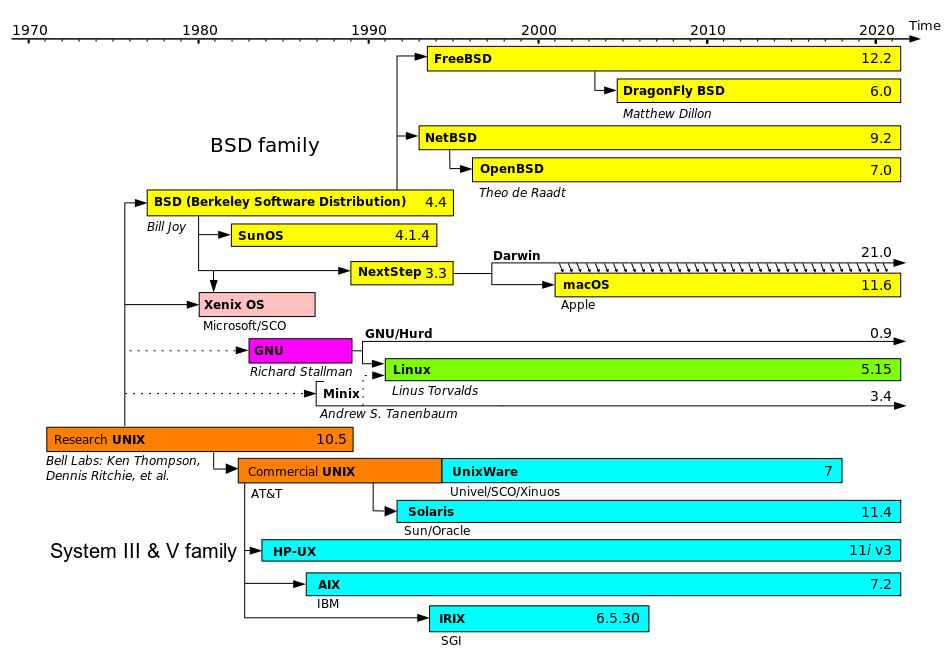

This article discusses the differences between BSD and GNU/Linux operating systems.

<!--more-->


When it comes to the most influential operating systems of all time, you can't go without mentioning Unix, Linux, and BSD. Our modern world couldn't exist without these operating systems.

While they share similarities in their basic principles and functions, there are also distinct differences that set them apart.

That said, in this article, our goal is to explain and compare these operating systems, exploring their origins, characteristics, and uses.

Let's dive in.


# Most Influential Operating Systems: Unix, BSD, and Linux  

When discussing the most influential operating systems of all time, it's impossible to overlook **Unix, BSD, and Linux**. Our modern world, from the internet to mobile devices, stands on the foundation they built. All three share basic principles—multi-user, multitasking, modularity—yet evolved with unique characteristics that distinguish them from one another.  

This article will explain the origins, characteristics, and uses of Unix, BSD, and Linux, while comparing their roles in the modern computing landscape.  

---

## **Unix: The Foundation of Modern Operating Systems**  

Unix was born in the late 1960s at **AT&T Bell Labs**, led by **Ken Thompson** and **Dennis Ritchie**. They created a simple yet powerful **multi-user and multitasking** operating system.  

Unix's design principles—**simplicity, modularity, hierarchical file system**—became the foundation for many subsequent OS developments. One of its key innovations was the **"pipe"**, which allowed the output of one program to be used as input for another, enhancing command-line flexibility.  

Unix evolved rapidly during the 1970s-1980s, adopted by universities, research institutions, and corporations. Its portability (thanks to being rewritten in C language) made it an industry standard. From Unix came many commercial variants (Solaris, HP-UX, AIX) as well as inspiration for open-source systems like BSD and Linux.  

Additionally, Unix gave birth to the **POSIX (Portable Operating System Interface)** standard, which ensures compatibility among modern operating systems.  

---

## **BSD: Innovation from Berkeley**  

**BSD (Berkeley Software Distribution)** emerged in the late 1970s at the University of California, Berkeley, as an enhancement to the Unix source code. BSD contributed important innovations, such as:  

- **TCP/IP stack**, the main foundation of the modern internet  
- **vi editor**, which remains popular to this day  

### **Modern BSD Variants**  
BSD evolved into an independent ecosystem, with main derivatives:  

- **FreeBSD** – focuses on performance & scalability, popular for servers and embedded systems  
- **OpenBSD** – emphasizes **security & code auditing**, widely used for firewalls and network infrastructure  
- **NetBSD** – known for portability, can run on almost any hardware architecture  

BSD also became the basis for major technologies: **Darwin (macOS & iOS kernel)**, and the **PlayStation 4** operating system.  

One thing that distinguishes BSD from Linux is its licensing. The **BSD License** is more permissive compared to **Linux's GPL**, allowing companies to adopt BSD code without having to open their modifications—the reason Apple chose BSD as the basis for macOS.  

---

## **Linux: Open Source for Everyone**  

Linux emerged in 1991, created by **Linus Torvalds** at the University of Helsinki. Unlike BSD, Linux **was not directly derived from Unix code**, but was written from scratch with Unix philosophy as inspiration.  

Linux is compatible with Unix standards (POSIX), modular, and **open-source** under the **GNU General Public License (GPL)**.  

### **Integration with GNU**  
Before Linux was born, the **GNU Project** (Richard Stallman, 1983) had already provided many important components:  
- GNU Compiler Collection (GCC)  
- GNU C Library (glibc)  
- GNU Core Utilities  

However, GNU lacked a fully functional kernel. The Linux kernel filled this gap, so the combination of **GNU/Linux** resulted in a complete and free operating system.  

### **Linux Dominance**  
Today, Linux:  
- Powers **>95% of the world's supercomputers**  
- Forms the core of **Android**, the most popular smartphone operating system  
- Runs the majority of **web servers & cloud computing**  
- Used in IoT, embedded devices, and desktops  

Popular distributions include **Ubuntu, Debian, Fedora, Arch Linux, and Red Hat Enterprise Linux**.  

---

## **Kernel and Architecture**  

All three systems use **monolithic kernels**, but with different approaches:  

- **Unix**: large kernel managing all services & hardware  
- **BSD**: monolithic kernel with enhancements like **ZFS filesystem**, **optimized network stack**, and security features like **Mandatory Access Control (MAC)**  
- **Linux**: **modular** monolithic kernel, allowing drivers & features to be loaded/unloaded as needed. This makes Linux flexible for various devices, from IoT to supercomputers  

---

## **Ecosystem and Community**  

- **Unix**: now mostly survives in commercial variants (Solaris, AIX) in companies with legacy systems  
- **BSD**: small but dedicated community, known for code quality and documentation  
- **Linux**: has the largest ecosystem with thousands of distributions and active global communities  

---

## **Usage and Considerations**  

- **Unix** → Still used in large corporations with legacy systems (banking, telecommunications, aerospace)  
- **BSD** → Suitable for firewalls, routers, and systems with high security/stability demands  
- **Linux** → Most flexible, used in cloud, servers, desktops, IoT, and supercomputers  

---

## **Interoperability and Compatibility**  

All three share the same heritage, so **many applications can be easily ported** between systems, especially those written in C/C++. Core command-line utilities (like `ls`, `grep`, `awk`) are also similar, making it relatively easy for users of one system to adapt to others.  

---

## **Comparison Table: Unix, BSD, and Linux**  

| Aspect            | Unix                              | BSD                                        | Linux                                   |
|-------------------|-----------------------------------|--------------------------------------------|-----------------------------------------|
| **Origins**       | 1969, AT&T Bell Labs              | 1977, UC Berkeley, Unix derivative         | 1991, Linus Torvalds, independent       |
| **License**       | Proprietary (AT&T, commercial)    | BSD License (permissive)                   | GPL (copyleft, open-source)             |
| **Focus**         | Commercial systems, stability     | Networking, security, portability          | Flexibility, community, open-source     |
| **Variants**      | Solaris, AIX, HP-UX               | FreeBSD, OpenBSD, NetBSD                   | Ubuntu, Debian, Fedora, RHEL, Arch      |
| **Usage**         | Corporations, mission-critical    | Servers, firewalls, basis for macOS & PS4  | Cloud, servers, desktop, Android, IoT   |
| **Current Status**| Limited, declining dominance      | Niche but important (security & research)  | Global dominance, extensive ecosystem   |

---

## **Conclusion**  

Unix, BSD, and Linux are not just operating systems, but the **backbone of the modern digital world**.  
- **Unix** laid the foundation with design principles and POSIX standards  
- **BSD** contributed important innovations, especially in networking and security  
- **Linux** extended influence worldwide through the open-source model, from global servers to smartphones in our pockets  

Together, these three form an ecosystem that continues to drive the evolution of computing technology.