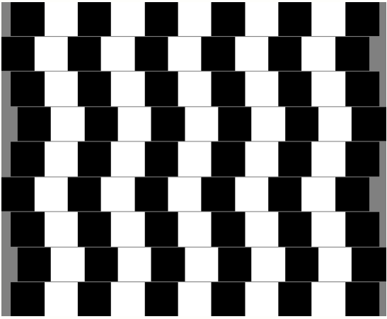

Artikel ini membahas ilusi visual di mana garis-garis sejajar tampak melengkung akibat pola persegi kontras dan offset posisi antar baris. Ilustrasi dibuat dengan LaTeX TikZ lengkap dengan penjelasan struktur kodenya.

<!--more-->

---

## Pendahuluan

Pernahkah kamu melihat dinding atau ubin yang terlihat seolah-olah bergelombang padahal sebenarnya lurus?  
Fenomena ini dikenal sebagai **Café Wall Illusion** — sebuah ilusi optik di mana **garis sejajar** tampak miring atau melengkung akibat **kontras persegi hitam-putih** dan **offset (geseran) horizontal antar baris**.

Dalam artikel ini, kita akan membangun pola ilusi tersebut menggunakan **LaTeX TikZ**, dan membahas **struktur kodenya secara lengkap** serta **konsep persepsi visual** yang menyebabkan terjadinya ilusi.

---

## Kode Sumber LaTeX

Berikut kode lengkap yang menghasilkan pola “dinding kafe” dengan efek melengkung:

```latex
\documentclass[tikz]{standalone}
\usetikzlibrary{calc}
\begin{document}
    \pagecolor{gray}
    \begin{tikzpicture}
        \pgfmathsetmacro{\offsety}{.05};
        \foreach \y / \offsetx in {0/0.3,1/0.5,2/0.3,3/0,4/0.3,5/0.5,6/0.3,7/0,8/0.3}
            \foreach \x in {0,...,10}{%
                \pgfmathifthenelse{mod(\x,2) == 0}{"black"}{"white"}
                \fill[\pgfmathresult] ($ (\x,\y)+(\offsetx,\offsety*\y) $) rectangle +(1,1);
            }
    \end{tikzpicture}
\end{document}
```

Keluaran yang dihasilkan:



---

## Penjelasan Struktur Kode

### **Deklarasi Dokumen**
```latex
\documentclass[tikz]{standalone}
```
Kelas `standalone` menghasilkan output berupa satu gambar tanpa margin atau halaman tambahan.  
Opsi `tikz` mengaktifkan pustaka **TikZ** untuk menggambar grafik berbasis vektor.

---

### **Pustaka yang Digunakan**
```latex
\usetikzlibrary{calc}
```
Pustaka `calc` memungkinkan operasi matematis dan manipulasi posisi titik secara dinamis di dalam TikZ.

---

### **Warna Latar Halaman**
```latex
\pagecolor{gray}
```
Memberi latar belakang berwarna abu-abu pada seluruh halaman untuk menambah kontras antara persegi hitam dan putih.

---

### **Mendefinisikan Area Gambar**
```latex
\begin{tikzpicture}
```
Memulai lingkungan TikZ yang berisi seluruh elemen grafis.

---

### **Variabel Vertikal Offset**
```latex
\pgfmathsetmacro{\offsety}{.05};
```
Mendefinisikan nilai offset vertikal kecil (`0.05`) untuk setiap baris — ini memberikan sedikit kemiringan antarbaris yang memperkuat efek ilusi.

---

### **Loop Baris dan Offset Horizontal**
```latex
\foreach \y / \offsetx in {0/0.3,1/0.5,2/0.3,3/0,4/0.3,5/0.5,6/0.3,7/0,8/0.3}
```
- Melakukan pengulangan untuk setiap baris (`\y`) dari 0 hingga 8.  
- Setiap baris memiliki offset horizontal (`\offsetx`) yang berbeda, sehingga pola tampak bergeser bergantian.

---

### **Loop Kolom dan Warna Persegi**
```latex
\foreach \x in {0,...,10}{
    \pgfmathifthenelse{mod(\x,2) == 0}{"black"}{"white"}
    \fill[\pgfmathresult] ($ (\x,\y)+(\offsetx,\offsety*\y) $) rectangle +(1,1);
}
```
Penjelasan langkah demi langkah:
- `\foreach \x in {0,...,10}` mengulangi persegi dari kolom 0 hingga 10.  
- `\pgfmathifthenelse{mod(\x,2) == 0}{"black"}{"white"}` menentukan warna secara bergantian: hitam untuk kolom genap, putih untuk kolom ganjil.  
- `\fill[...] ... rectangle +(1,1);` menggambar persegi berukuran 1×1 unit dengan warna yang ditentukan.  
- Posisi persegi digeser dengan koordinat `($ (\x,\y)+(\offsetx,\offsety*\y) $)` sehingga tiap baris sedikit bergeser ke kanan atau kiri.

---

### **Menutup Lingkungan TikZ**
```latex
\end{tikzpicture}
```
Menandakan akhir dari blok gambar TikZ. Hasil akhirnya adalah pola kotak-kotak seperti dinding ubin dengan efek bergelombang.

---

## Analisis Visual dan Ilmiah

Meskipun setiap baris persegi sejajar secara matematis, otak kita memproses kontras antara **tepi gelap dan terang** secara lokal.  
Efek *lateral inhibition* (hambatan lateral) di retina membuat otak mempersepsikan garis batas di antara dua warna kontras sebagai **miring atau melengkung**.

| Faktor | Efek Visual |
|--------|--------------|
| Pergeseran baris (offset) | Membuat garis sejajar tampak miring |
| Kontras hitam-putih | Meningkatkan efek perbedaan arah |
| Latar abu-abu | Menambah persepsi kedalaman semu |

---

## Eksperimen dan Variasi

| Parameter | Fungsi | Efek Visual |
|------------|----------|-------------|
| `\offsetx` | Pergeseran horizontal antarbaris | Meningkatkan atau mengurangi kemiringan semu |
| `\offsety` | Pergeseran vertikal per baris | Menciptakan efek gelombang |
| Warna | Mengubah persepsi kontras | Misal gunakan `blue` dan `yellow` |
| Ukuran persegi | Ubah `(1,1)` menjadi `(0.8,0.8)` | Pola lebih padat, efek lebih kuat |

Contoh variasi:
```latex
\foreach \y / \offsetx in {0/0,1/0.2,2/0.4,3/0.6}{
    \foreach \x in {0,...,12}{
        \pgfmathifthenelse{mod(\x,2)==0}{"black"}{"white"}
        \fill[\pgfmathresult] ($ (\x,\y)+(\offsetx,0.05*\y) $) rectangle +(1,1);
    }
}
```

---

## Relevansi Ilmiah dan Artistik

Ilusi Dinding Kafe bukan hanya permainan visual — tetapi juga bahan kajian penting di bidang:
- **Psikologi persepsi**, untuk memahami bagaimana otak memproses kontras dan bentuk.  
- **Neurosains visual**, untuk mempelajari kerja neuron pada deteksi tepi.  
- **Desain grafis dan arsitektur**, untuk menciptakan efek ruang atau gerak semu.  
- **Seni matematis**, di mana geometri dan persepsi berpadu menciptakan harmoni visual.

---

## Kesimpulan

Ilusi Dinding Kafe menunjukkan bahwa persepsi visual manusia sangat dipengaruhi oleh **konteks spasial dan kontras luminans**.  
Dengan **LaTeX TikZ**, kita dapat merekonstruksi fenomena ini secara presisi dan estetis — menggabungkan sains, seni, dan matematika dalam satu representasi elegan.

---

## Referensi

1. Gregory, R. L. (1997). *Eye and Brain: The Psychology of Seeing.* Oxford University Press.  
2. Wade, N. J. (1986). *Perception and Illusion: Historical Perspectives.* Springer.  
3. Fraser, J. (1908). *A new visual illusion of direction.* British Journal of Psychology.  
4. PGF/TikZ Manual, Version 3.1.10 (2023).  

---

**Ditulis oleh:** [Aan Triono](https://www.aantriono.com)  
**Lisensi:** CC BY-SA 4.0
