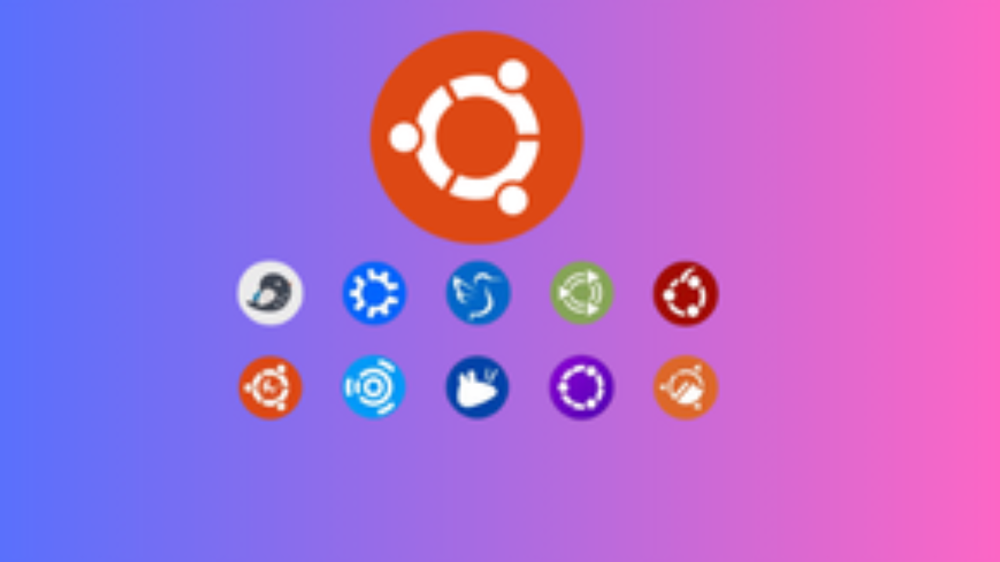

本文介紹一款廣受歡迎、對使用者友善、容易上手並適合各種用途的 Linux 發行版——Ubuntu。

---

## 前言

在付費作業系統（operating system）主導的時代，Ubuntu 以「自由、安全與高效率」為理念，提供無須授權費的替代方案。作為全球最受歡迎的 Linux 發行版之一，Ubuntu 已證明其對初學者及專業 IT 人員而言，皆是穩定且易用的系統選擇。

## 什麼是 Ubuntu？

Ubuntu 是一個基於 Linux 的作業系統，由 Canonical Ltd. 公司開發，該公司由南非企業家 Mark Shuttleworth 創立。「Ubuntu」這個名稱源自非洲哲學，意為「人性與共」或「我之存在，因為我們同在」，象徵著社群精神與分享的核心理念。

此系統建立於 Debian 發行版之上，Debian 是歷史最悠久且最穩定的 Linux 系統之一。Ubuntu 以 Debian 為基礎，並重新包裝成更易於使用的介面，使初學者能輕鬆進入 Linux 世界。

## Ubuntu 的主要特點

### 1. 開源與免費（Open Source & Free）

與商業作業系統不同，Ubuntu 完全免費下載、使用與散佈。其開放原始碼（open source）特性讓任何人都能檢視、修改與改進程式碼，這不僅關乎價格，更體現了技術自由與透明性。

### 2. 強大的安全性（Security）

Ubuntu 將安全視為首要考量。系統內建防火牆（firewall）、資料加密（encryption）與自動安全更新。基於 Linux 架構的設計，Ubuntu 對病毒與惡意軟體的防護力遠高於其他系統。

### 3. 穩定與高效能（Stability & Performance）

Ubuntu 提供長期支援版本（LTS, Long-Term Support），可獲得長達 5 年的更新與安全修補，非常適合企業環境或追求穩定的使用者。

### 4. 直覺化的使用者介面（User Interface）

*Ubuntu 25.04 的 GNOME 桌面環境（desktop environment）現代且優雅*
> **註**：更多截圖請參閱 [ubuntu.com/desktop](https://ubuntu.com/desktop)

Ubuntu 採用 GNOME 桌面環境，提供現代、整潔、且易於操作的使用體驗。畫面左側的 Dock 提供快速應用啟動，而「活動概覽（Activities Overview）」讓檔案與設定搜尋更方便。

## 不同用途的 Ubuntu 版本

*多種 Ubuntu 分支版本（flavors），針對不同使用需求設計*
> **註**：完整版本清單請見 [ubuntu.com/desktop/flavours](https://ubuntu.com/desktop/flavours)

- **Ubuntu Desktop**：完整圖形介面，適用於個人與辦公使用。  
- **Ubuntu Server**：為伺服器（server）與雲端（cloud computing）環境優化，無圖形介面以提升效能。  
- **Ubuntu Studio**：針對內容創作者設計，內建多媒體專業應用。  
- **Kubuntu、Xubuntu、Lubuntu**：分別採用 KDE、Xfce、LXQt 桌面環境，滿足不同效能需求。

## 使用 Ubuntu 的優勢

### 活躍的社群支援

Ubuntu 擁有全球最活躍的開源社群之一，提供豐富的論壇、文件與教學資源。當遇到問題時，通常能在社群中找到解決方案。

### 廣泛的硬體相容性

Ubuntu 支援多種硬體，從舊筆電到最新工作站。大部分驅動程式已預裝於系統中。

### 豐富的應用生態系

*Ubuntu 軟體中心（Software Center）提供數千款免費應用*

使用者可透過 Ubuntu 軟體中心輕鬆安裝應用，如 LibreOffice、Firefox、Chrome、VLC 等，無需命令列（command line）操作。

### 適合開發者（Developers）

Ubuntu 為開發人員首選，支援多種程式語言與開發工具，並擁有優秀的 Unix 環境，非常適合用於網頁、行動或桌面應用開發。

## 安裝指南（Installation Guide）

1. 備份重要資料（Backup）  
2. 檢查最低系統需求：CPU ≥ 2GHz、RAM ≥ 4GB、硬碟 ≥ 25GB  
3. 下載 ISO 映像檔（image file）並製作可開機 USB（bootable USB）。  
4. 從 USB 開機後選擇「Install Ubuntu」。  
5. 設定語言、鍵盤、網路與時區。  
6. 選擇安裝方式（單系統或雙重啟動 dual-boot）。  
7. 建立使用者帳戶（user account）。  
8. 等待 15–30 分鐘完成安裝後重新啟動系統。

## 結論

Ubuntu 是一款結合高效能、穩定性與易用性的完整作業系統，適合個人與企業使用。其強大的社群支援與開放原始碼精神，讓 Ubuntu 成為全球數百萬使用者的首選。

---

*想嘗試 Ubuntu 嗎？立即前往 [ubuntu.com](https://ubuntu.com) 下載最新版本，展開你的開源之旅！*
