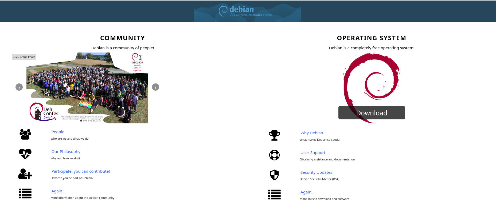



Debian is one of the oldest and most respected Linux distributions, known for its stability, security, and free software principles.  
In this article, we will discuss its history, characteristics, variants, use in software development, as well as its advantages and disadvantages — in depth yet easy to understand.



---


## A Brief History of Debian

- Debian was founded in August 1993 by **Ian Murdock** as a community project aimed at providing a *universal, free, and high-quality* Linux operating system.  
- From the beginning, Debian has embraced the spirit of free software and global collaboration.  
- Debian release names follow characters from the *Toy Story* movies (such as "Jessie", "Bullseye", "Bookworm", and so on).  
- Debian serves as the foundation for many other popular distributions such as **Ubuntu**, **Linux Mint**, and other variants.  
- Analysis of Debian 3.0 showed that this project was massive in code scope: over 105 million lines of source code.  
  > Source: [arxiv.org](https://arxiv.org/abs/cs/0506067)

---

## Philosophy and Community



### Debian Philosophy

Debian is based on the following principles:

- **Software freedom** — only using and supporting free software.  
- **Quality and stability** — every package is rigorously tested before entering stable releases.  
- **Transparency and collaboration** — decisions are made through community consensus.  
- **User focus** — technical decisions are directed toward the interests of users and developers.

### Debian Community

- Fully managed by volunteers from around the world.  
- Has dedicated teams such as maintainers, security teams, and documentation teams.  
- Major decisions are made through community voting processes.  
- The Debian community is also known for its extremely comprehensive documentation.

---

## Debian Releases & Release Model

Debian has three main branches:

| Branch | Characteristics | Primary Use |
|---|---|---|
| **Stable** | Official and very stable version | Production systems and servers |
| **Testing** | Newer packages, being tested | Users who want a balance of stability and updates |
| **Unstable (Sid)** | Latest and experimental packages | Developers and testers |

- Debian stable releases appear every 2–3 years.  
- New packages are tested in *unstable*, then move to *testing*, and finally to *stable*.  
- Users can also use *backports* to get newer package versions without changing releases.

---

## Architecture and Package Management

### Supported Architectures

Debian supports various hardware architectures such as **amd64**, **i386**, and **ARM** (various variants).

### Package System & Management

Debian uses the **.deb** package system with management through **APT (Advanced Package Tool)**.

Some basic commands:

```bash
sudo apt update
sudo apt upgrade
sudo apt install <package-name>
sudo apt remove <package-name>
```

Repositories are divided into three sections:

- **main** — completely free software.  
- **contrib** — free software that depends on non-free packages.  
- **non-free** — software that is not completely license-free.

---

## Debian Variants and Derivatives

Due to its open nature, many distributions are built on top of Debian. Here are some examples:

- **Ubuntu** — the most popular Debian derivative with a user-friendly interface.  
- **Linux Mint Debian Edition (LMDE)** — Mint version based directly on Debian.  
- **SolydXK** — based on Debian Stable, with KDE and Xfce desktops.  
- **Elive** — uses the Enlightenment desktop with an elegant appearance.  
- **AVLinux** — focused on audio and multimedia production.

These derivatives typically add configurations, custom kernels, or additional packages according to user needs.

---

## Debian for Developers / Programmers

Debian is widely used by software developers due to its stability and package availability.

### Development Tools & Environment

- **build-essential** package: gcc, g++, make, and basic libraries.  
- Popular programming languages such as **Python**, **Node.js**, **Java**, and **Go** are available directly from repositories.  
- Version control systems like **Git** are easily installed.  
- Popular editors like **VS Code** and **Sublime Text** can be installed with `.deb` packages or external repositories.  
  > Reference: [dev.to/seanpetiya](https://dev.to/seanpetiya/a-simple-dev-environment-with-visual-studio-code-on-debian-linux-4mie)

### Advantages for Developers

- **Stable and secure** — suitable for long-term development.  
- **High reproducibility** — consistent configuration across systems.  
- **Large community** — comprehensive documentation and active community support.  
- **Full customization** — users can determine package versions or build their own.  

### Challenges

- Package versions in *stable* are often behind the latest versions.  
- Some proprietary drivers require additional configuration.  
- For new users, the CLI might feel difficult at first.  
  > "Debian is great but you're stuck with pretty old versions of many packages on Debian stable."  
  > — [r/linuxquestions](https://www.reddit.com/r/linuxquestions/comments/1ee4pmk/best_distro-for-programming-and-developing)

---

## Advantages and Disadvantages of Debian

### Advantages

1. Very stable and secure.  
2. Completely free and open source.  
3. Large community and extensive documentation.  
4. Supports many architectures.  
5. Very large package ecosystem.  
6. Flexible for both servers and desktops.

### Disadvantages

1. Package versions in *stable* can be outdated.  
2. Installing non-free drivers is not always easy.  
3. Learning curve is quite steep for beginners.  
4. Major updates require extra attention.

---

## Tips for Getting Started with Debian

- Use the **stable release** for beginners or servers.  
- Enable *contrib* and *non-free* repositories if needed.  
- Backup the `sources.list` file before adding new repositories.  
- Use `apt-mark hold <package>` to hold specific versions.  
- Learn how to build `.deb` packages yourself.  
- Follow the Debian community through forums or mailing lists.

---

## Conclusion

Debian is an important pillar in the Linux world.  
The combination of stability, security, and community spirit makes it a strong foundation for many other distributions.  

For new users, Debian might seem technical. However, for developers and system administrators, Debian is a reliable, secure, and flexible choice — suitable for desktops, servers, and software development.

---

> **Additional References:**  
> - [Debian Official Website](https://www.debian.org/)  
> - [Wikipedia: Debian](https://en.wikipedia.org/wiki/Debian)  
> - [Debian Developer's Corner](https://wiki.debian.org/DevelopersCorner)