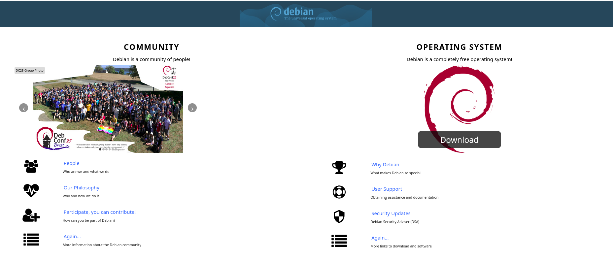

Debian 是最古老、最受尊敬的 Linux 发行版之一，以其稳定性、安全性以及对自由软件原则的坚持而闻名。  
本文将深入探讨 Debian 的历史、特点、变体、在软件开发中的应用，以及其优缺点，并以易于理解的方式呈现。

---

<!--more-->


**注意**：本文在 AI 技术的辅助下生成，并经过人工审阅以确保信息的准确性和清晰度。


---

## 1. Debian 简史

- Debian 于 1993 年 8 月由 **Ian Murdock** 创立，旨在提供一个*通用、自由且高质量*的 Linux 操作系统。  
- 从一开始，Debian 就以自由软件和全球协作为核心精神。  
- Debian 的版本名称取自电影 *Toy Story* 中的角色（如 “Jessie”、 “Bullseye”、 “Bookworm”等）。  
- Debian 是许多流行发行版的基础，例如 **Ubuntu**、**Linux Mint** 等。  
- 对 Debian 3.0 的分析显示，该项目规模庞大，源代码超过 1.05 亿行。  
  > 来源: [arxiv.org](https://arxiv.org/abs/cs/0506067)

---

## 2. 哲学与社区



### Debian 哲学

Debian 的原则包括：

- **自由软件** — 只使用并支持自由软件。  
- **质量与稳定性** — 每个软件包在进入稳定版之前都经过严格测试。  
- **透明与协作** — 所有决策通过社区共识完成。  
- **以用户为中心** — 技术决策始终以用户和开发者的利益为导向。

### Debian 社区

- 完全由全球志愿者管理。  
- 设有维护、 安全、 文档等专业团队。  
- 重大决策通过社区 *投票* 完成。  
- Debian 社区以其全面详尽的文档而著称。

---

## 3. Debian 发布与版本模型

Debian 有三个主要分支：

| 分支 | 特点 | 主要用途 |
|---|---|---|
| **Stable（稳定版）** | 官方发布，极为稳定 | 生产系统与服务器 |
| **Testing（测试版）** | 包较新，处于测试阶段 | 希望平衡稳定与更新的用户 |
| **Unstable（Sid）** | 最新、实验性软件包 | 开发者与测试者 |

- 稳定版大约每 2–3 年发布一次。  
- 新包先进入 *unstable*，再到 *testing*，最后进入 *stable*。  
- 用户可使用 *backports* 获取较新软件包而无需更换版本。

---

## 4. 架构与软件包管理

### 支持的架构

Debian 支持多种硬件架构，如 **amd64**、**i386**、**ARM**（多种变体）。

### 软件包系统与管理

Debian 使用 **.deb** 格式的软件包，并通过 **APT（Advanced Package Tool）** 管理。

常用命令：

```bash
sudo apt update
sudo apt upgrade
sudo apt install <软件包名称>
sudo apt remove <软件包名称>
```

仓库分为三部分：

- **main** — 完全自由软件。  
- **contrib** — 自由软件但依赖非自由组件。  
- **non-free** — 含有非自由许可的软件。

---

## 5. Debian 变体与衍生版

由于其开放性，许多发行版基于 Debian 构建：

- **Ubuntu** — 最流行的衍生版，拥有友好的图形界面。  
- **Linux Mint Debian Edition (LMDE)** — 直接基于 Debian 的 Mint 版本。  
- **SolydXK** — 基于 Debian Stable，使用 KDE 与 Xfce 桌面。  
- **Elive** — 使用 Enlightenment 桌面，外观优雅。  
- **AVLinux** — 专注于音频与多媒体制作。  

这些衍生版通常添加了额外配置、特制内核或软件包以满足用户需求。

---

## 6. Debian 与开发者

Debian 因稳定性和丰富的软件包而被众多开发者采用。

### 开发工具与环境

- **build-essential** 包：gcc、g++、make 及基本库。  
- 流行语言（**Python**, **Node.js**, **Java**, **Go**）均可直接从仓库安装。  
- **Git** 等版本控制系统安装便捷。  
- 编辑器如 **VS Code** 和 **Sublime Text** 可通过 `.deb` 安装包或外部仓库获取。  
  > 参考: [dev.to/seanpetiya](https://dev.to/seanpetiya/a-simple-dev-environment-with-visual-studio-code-on-debian-linux-4mie)

### 对开发者的优势

- **稳定、安全** — 适合长期开发环境。  
- **高可复现性** — 系统配置一致性强。  
- **庞大社区** — 文档全面、支持活跃。  
- **高度可定制** — 可自行选择软件包版本或编译构建。  

### 挑战

- 稳定版软件包版本偏旧。  
- 某些闭源驱动需额外配置。  
- 对新手而言命令行学习曲线较陡。  
  > “Debian 很棒，但稳定版的软件版本较旧。”  
  > — [r/linuxquestions](https://www.reddit.com/r/linuxquestions/comments/1ee4pmk/best_distro-for-programming-and-developing)

---

## 7. 优缺点

### 优点

1. 极其稳定和安全。  
2. 完全免费与开源。  
3. 社区庞大、文档详尽。  
4. 支持多种架构。  
5. 软件生态丰富。  
6. 适用于服务器与桌面。

### 缺点

1. 稳定版软件包版本落后。  
2. 非自由驱动安装不够简便。  
3. 新手学习曲线较高。  
4. 大版本升级需谨慎操作。

---

## 8. 入门建议

- 新手或服务器推荐使用 **稳定版（Stable）**。  
- 根据需要启用 *contrib* 与 *non-free* 仓库。  
- 修改前备份 `sources.list` 文件。  
- 使用 `apt-mark hold <软件包>` 锁定版本。  
- 学习如何自行构建 `.deb` 包。  
- 参与 Debian 论坛或邮件列表。

---

## 9. 总结

Debian 是 Linux 世界的重要基石。  
其稳定性、安全性及社区精神，使其成为众多发行版的核心基础。  

对新手而言，Debian 可能略显复杂；但对开发者与系统管理员来说，Debian 是可靠、安全且灵活的选择，适用于桌面、服务器及软件开发环境。

---

> **更多参考：**  
> - [Debian 官方网站](https://www.debian.org/)  
> - [维基百科：Debian](https://zh.wikipedia.org/wiki/Debian)  
> - [Debian Developer’s Corner](https://wiki.debian.org/DevelopersCorner)
