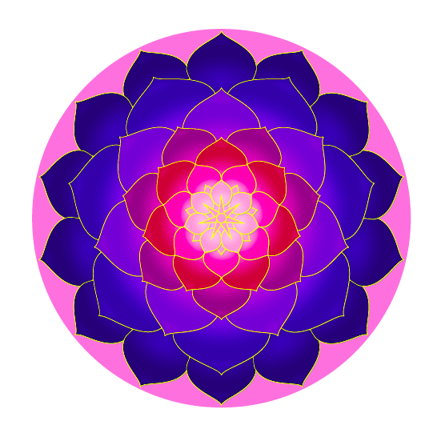

Panduan lengkap menggambar mandala menggunakan LaTeX TikZ — menyertakan kode .tex lengkap dan penjelasan baris demi baris.

<!--more-->

---

## Pendahuluan

Mandala merupakan pola geometris yang melambangkan keteraturan, keseimbangan, dan harmoni. Biasanya, mandala digunakan dalam seni dan meditasi sebagai simbol kesatuan antara mikrokosmos dan makrokosmos.

Dalam konteks komputasi, kita dapat menggambar mandala secara **otomatis dan presisi tinggi** menggunakan **LaTeX** dengan paket **TikZ**, sebuah pustaka grafis vektor yang sangat kuat.

Artikel ini menjelaskan secara lengkap bagaimana kode LaTeX berikut menghasilkan mandala yang indah dan berlapis warna menggunakan fitur geometri, transformasi, dan efek bayangan dari TikZ.

---

## Kode LaTeX Lengkap

```latex
\documentclass{article}
\usepackage[margin=0.3cm, paperwidth=8.4cm, paperheight=8.4cm]{geometry}
\usepackage{tikz}
\usetikzlibrary{shadows}
\usetikzlibrary{fadings}

\tikzfading[name=fade out, inner color=transparent!0,
  outer color=transparent!100]

\def\petal { 
  [rounded corners=0.5]
  (-1,0)
  .. controls (-1,0.6) and (-0.07,0.8).. (0,1)
  .. controls (0.07,0.8) and (1,0.6).. (1,0)
  .. controls (0.7,-1) and (-0.7,-1).. (-1,0)
}

\def\background[#1,#2]{
  \fill[#1] (0,0) circle (3.9);
  \fill[#2] (0,0) circle (1);
}

\def\center[#1]{
  \foreach \a in {51.4285,102.857,...,360} {
    \draw[color=yellow,rotate=\a,fill=#1]
    (-0.08,0) -- (0,0.46) -- (0.08,0);
  }
  \draw[color=yellow,fill=#1] (0,0) circle (0.1);
}

\def \mandala {
  \background[red!30!blue!70!black,blue!70!yellow!50];
  \foreach \ysh/\xs/\ys/\af/\as/\y/\b/\w/\r/\bl in {
    3.06/0.72/0.8/25.71425/51.4285/70/100/100/100/100,
    2.34/1/0.9/25.71425/77.14275/6/90/92/80/80,
    1.8/0.8/0.9/51.4285/102.857/0/75/100/60/70,
    1.5/0.6/0.6/25.71425/77.14275/0/55/100/40/60,
    1.1/0.53/0.58/51.4285/102.857/0/40/100/20/50,
    0.8/0.37/0.45/25.71425/77.14275/0/45/85/20/40,
    0.53/0.1/0.24/25.71425/77.14275/0/10/100/0/30,
    0.49/0.22/0.32/51.4285/102.857/0/10/100/0/50
  } {
    \foreach \a in {\af,\as,...,360} {
      \begin{scope}[rotate=\a,shift={(0,\ysh)},xscale=\xs,yscale=\ys]
        \draw[color=yellow,fill=yellow!\y!red!\b!blue!\w]
        [drop shadow={shadow xshift=0.5pt, shadow yshift=-0.5pt}]
        \petal;
      \end{scope}
      \begin{scope}[transform canvas={rotate=\a},shift={(0,\ysh)},xscale=\xs,yscale=\ys]
        \clip \petal;
        \fill[path fading=fade out,fill=red!\r!blue!\bl!black, opacity=0.7]
        (0,-0.35) ellipse (1.2 and 0.75);
        \fill[path fading=fade out,fill=red!\r!blue!\bl!black, opacity=0.3]
        (0,-0.2) ellipse (1.2 and 0.4);
        \fill[path fading=fade out,fill=red!\r!blue,opacity=0.2]
        (-0.4,0.6) -- (0,0.9) -- (0.4,0.6);
      \end{scope}
    }
  }
  \center[blue]
}

\pagestyle{empty}
\setlength{\parindent}{0pt}
\begin{document}
\tikz\mandala;

\tikz\mandalac[magenta!30!,magenta,purple,violet,];
\tikz\mandalac[blue!40!black,violet,purple,pink,];
\tikz\mandalac[lime!90!black,yellow!95!black,orange,red,];
\tikz\mandalac[green!80!black,yellow,pink,purple!90!,red];
\tikz\mandalab[green!50!black, green!60!black, green!70!black!80!, green!50!,
  green!10!, pink!40!, red!40!,];
\tikz\mandalab[blue!30!black, blue!40!black, blue!60!black, blue!70!black!80!,
  blue!50!, yellow!40!, yellow!70!,];
\end{document}
```
---

Keluaran yang dihasilkan:



## Persiapan Dasar Dokumen

Bagian awal kode menyiapkan jenis dokumen dan ukuran kanvas gambar.

```latex
\documentclass{article}
\usepackage[margin=0.3cm, paperwidth=8.4cm, paperheight=8.4cm]{geometry}
\usepackage{tikz}
\usetikzlibrary{shadows}
\usetikzlibrary{fadings}
```

**Penjelasan:**

- `geometry` digunakan untuk mengatur margin dan ukuran kertas (8.4×8.4 cm).
- `tikz` adalah paket utama untuk menggambar.
- `shadows` dan `fadings` menambahkan efek bayangan dan gradasi lembut pada elemen visual.

Selain itu, dibuat definisi fading agar tepi objek dapat memudar secara bertahap:

```latex
\tikzfading[name=fade out, inner color=transparent!0, outer color=transparent!100]
```

---

## Membentuk Elemen Dasar: Kelopak Bunga (Petal)

Elemen visual utama mandala ini adalah bentuk kelopak bunga, didefinisikan dengan kurva Bézier:

```latex
\def\petal { 
  [rounded corners=0.5]
  (-1,0)
  .. controls (-1,0.6) and (-0.07,0.8).. (0,1)
  .. controls (0.07,0.8) and (1,0.6).. (1,0)
  .. controls (0.7,-1) and (-0.7,-1).. (-1,0)
}
```

**Penjelasan:**

- Bentuk ini menggambarkan satu kelopak simetris dengan ujung membulat.
- Titik kontrol (control points) menentukan kelengkungan kelopak agar tampak alami dan proporsional.

---

## Latar Belakang dan Pusat Mandala

### Latar Belakang

Dibentuk dengan dua lingkaran berwarna:

```latex
\def\background[#1,#2]{
  \fill[#1] (0,0) circle (3.9);
  \fill[#2] (0,0) circle (1);
}
```

**Penjelasan:**

- Warna pertama `#1` adalah warna lingkaran luar.
- Warna kedua `#2` adalah warna pusat, memberikan efek kontras.

### Pusat Mandala (Center)

Bagian tengah mandala dihiasi bintang kecil dengan warna gradasi:

```latex
\def\center[#1]{
  \foreach \a in {51.4285,102.857,...,360} {
    \draw[color=yellow,rotate=\a,fill=#1]
    (-0.08,0) -- (0,0.46) -- (0.08,0);
  }
  \draw[color=yellow,fill=#1] (0,0) circle (0.1);
}
```

**Penjelasan:**

- Bintang terbentuk dari pengulangan segitiga kecil yang diputar beberapa derajat.
- Warna pusat diatur melalui parameter `#1` (biasanya biru atau ungu).

---

## Mandala Dasar (Fixed Colouring)

Definisi berikut menghasilkan satu mandala dengan kombinasi warna tetap:

```latex
\def \mandala {
  \background[red!30!blue!70!black,blue!70!yellow!50];
  ...
  \center[blue]
}
```

**Penjelasan:**

Bagian inti menggunakan perulangan `\foreach` untuk menggambar lapisan-lapisan kelopak secara berulang dengan rotasi dan pergeseran posisi (`rotate`, `shift`, `xscale`, `yscale`).

Efek bayangan dibuat dengan:

```latex
[drop shadow={shadow xshift=0.5pt, shadow yshift=-0.5pt}]
```

Efek cahaya lembut menggunakan:

```latex
\fill[path fading=fade out, fill=red!... , opacity=0.7]
```

Hasilnya adalah mandala dengan nuansa warna yang kaya dan kedalaman visual yang nyata.

---

## Mandala Parametrik (Parametric Colouring)

Untuk variasi warna yang lebih dinamis, dua versi mandala parametrik disediakan.

### `\mandalac` — Lima Parameter Warna

```latex
\def \mandalac[#1,#2,#3,#4,#5]{ ... }
```

**Makna Parameter:**

- `#1` warna lapisan terluar
- `#2` warna lapisan ketiga
- `#3` warna lapisan kelima
- `#4` warna lapisan ketujuh
- `#5` warna efek fading (gradasi ke dalam)

**Contoh Pemanggilan:**

```latex
\tikz\mandalac[blue!40!black,violet,purple,pink,];
```

### `\mandalab` — Delapan Parameter Warna

Versi ini memberi kendali lebih terhadap setiap lapisan warna:

```latex
\def \mandalab[#1,#2,#3,#4,#5,#6,#7,#8]{ ... }
```

**Penjelasan:**

- Lapisan warna diatur bertahap dari luar ke pusat.
- `#8` mengontrol intensitas efek gradasi (fading).

Dengan makro ini, pengguna dapat menghasilkan mandala dengan kombinasi warna yang sangat kompleks.

---

## Hasil Akhir

Bagian akhir kode menghasilkan beberapa variasi mandala dengan skema warna berbeda:

```latex
\tikz\mandala;
\tikz\mandalac[magenta!30!,magenta,purple,violet,];
\tikz\mandalac[lime!90!black,yellow!95!black,orange,red,];
\tikz\mandalab[blue!30!black, blue!40!black, blue!60!black, blue!70!black!80!, blue!50!, yellow!40!, yellow!70!,];
```

**Hasil:**

Kumpulan pola mandala yang menampilkan:

- Perbedaan lapisan warna dan gradasi,
- Tekstur visual lembut akibat shadow dan fading, serta
- Harmoni geometris melalui rotasi teratur 360°.

Semua pola ini dihasilkan sepenuhnya melalui kode, tanpa bantuan perangkat lunak desain grafis eksternal.

---

## Kesimpulan

Menggambar mandala dengan LaTeX dan TikZ menunjukkan bahwa sistem typesetting ilmiah ini tidak terbatas pada teks dan rumus, tetapi juga mampu menciptakan karya seni visual yang kompleks.

Dengan memanfaatkan:

- Kurva Bézier untuk bentuk organik,
- Transformasi (rotasi, skala, translasi) untuk menciptakan simetri, dan
- Efek bayangan serta gradasi (fading) untuk kedalaman visual,

pengguna dapat membuat pola mandala yang indah, presisi, dan estetis, seluruhnya berbasis kode.

Pendekatan ini memadukan logika matematis dan keindahan artistik — menjadikan LaTeX bukan hanya alat penulisan ilmiah, tetapi juga kanvas digital untuk seni geometri.

---

## Referensi

1. Tantau, T. (2024). *TikZ & PGF Manual, Version 3.1.10 — The Definitive Guide to Graphics in LaTeX*.
2. Botoeva, E. (2018). *The Beauty of Symmetry: Drawing Mandalas with TikZ*.
3. Overleaf. *TikZ Examples Gallery*. https://www.overleaf.com/gallery/tagged/tikz

**Ditulis oleh:** [Aan Triono](https://www.aantriono.com)  
**Lisensi:** CC BY-SA 4.0
