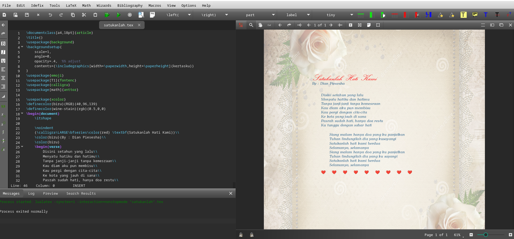

Compilation is the process of translating LaTeX commands into a ready-to-print document.  
This article discusses how LaTeX compilation works, types of compilers available, the compilation sequence, and how to resolve errors efficiently.

<!--more-->

---

## Introduction

LaTeX is a document preparation system that produces high-quality output, especially for scientific and technical text.  
Unlike conventional word processors, a LaTeX document **must be compiled** before a `.tex` file can be converted into the final format such as `.pdf`, `.dvi`, or `.ps`.


**Note:** This article was generated with the help of AI technology and has been manually reviewed to ensure accuracy and clarity.


---

## What is LaTeX Compilation?

LaTeX compilation is the process performed by a *compiler* to read the source file (usually with the `.tex` extension), interpret the commands inside (`\section{}`, `\usepackage{}`, etc.), and produce an output file such as `.pdf`.

In short:

```
document.tex → [compiler] → document.pdf
```

This process differs from a typical *word processor* like Microsoft Word because LaTeX separates **content writing** from **output rendering**.

---

## Types of LaTeX Compilers

Here are some commonly used LaTeX compilers:

| Compiler | Main Output | Advantages | Disadvantages |
|-----------|--------------|-------------|----------------|
| **pdfLaTeX** | PDF directly | Fast, stable, compatible with most packages | Limited to TeX fonts and ASCII input |
| **XeLaTeX** | PDF | Supports Unicode and system fonts (TTF/OTF) | Slightly slower |
| **LuaLaTeX** | PDF | Supports Lua scripting, high performance | Less stable with older packages |
| **LaTeX → DVI → PS → PDF** | PDF/DVI | Classic method, suitable for legacy projects | Long process and rarely used today |

> 💡 **Recommendation:** Use `pdfLaTeX` for standard documents, `XeLaTeX` for non-Latin languages (e.g., Indonesian, Japanese, Arabic), and `LuaLaTeX` for projects involving advanced graphics or scripting.

---

## The Compilation Process

When compiling, LaTeX goes through several stages:

1. **Reads the `.tex` file** — the compiler processes the preamble (`\usepackage{}`) and the main document body.  
2. **Builds document structure** — generates the table of contents, labels, references, and indexes.  
3. **Processes math symbols, images, and tables.**  
4. **Creates auxiliary files** such as:
   - `.aux` → for cross-references (`\ref`, `\cite`)
   - `.toc` → for the table of contents
   - `.log` → for error logs  
5. **Produces the final output (`.pdf` or `.dvi`).**

Because of these auxiliary files, **LaTeX documents often need to be compiled more than once**, especially when using cross-references, tables of contents, or bibliographies.

---

## Compilation via Terminal

For local system users (Windows, macOS, Linux), compilation can be performed via the command line.

Example:

```bash
pdflatex document.tex
bibtex document
pdflatex document.tex
pdflatex document.tex
```

Steps:
1. First compilation: generates `.aux` and `.toc`.
2. Run `bibtex` (if a bibliography is used).
3. Recompile to update references.
4. Final compilation for the finished output.

> ⚙️ If you’re using `biber` (with `biblatex`), replace `bibtex` with `biber document`.

---

## Compilation via Editor Environments

Besides the terminal, compilation can also be done directly from LaTeX editors. Common options include:


### Overleaf (Online)
- Automatically compiles whenever you save.
- Choose the compiler via **Menu → Compiler → pdfLaTeX/XeLaTeX**.
- No local installation required.

### TeXworks / TeXstudio (Offline)
- Press **Ctrl + T** or click the “Typeset” icon.
- Select the compiler from the dropdown list.
- Suitable for Windows/macOS users.



### Visual Studio Code + LaTeX Workshop
- A popular extension among modern users.
- Supports build chain automation (e.g., pdflatex → bibtex → pdflatex → pdflatex).
- Configuration file: `.vscode/settings.json`

Example configuration:

```json
"latex-workshop.latex.recipes": [
  {
    "name": "pdflatex -> bibtex -> pdflatex x2",
    "tools": ["pdflatex", "bibtex", "pdflatex", "pdflatex"]
  }
]
```

---

## Common Compilation Errors

Here are common LaTeX compilation errors and how to fix them:

| Error Message | Cause | Solution |
|----------------|--------|-----------|
| `! Undefined control sequence.` | Unknown command | Ensure the required package is loaded (`\usepackage{}`) |
| `! LaTeX Error: File 'xxx.sty' not found.` | Missing package | Install using a package manager (`tlmgr install xxx`) |
| `! Missing $ inserted.` | Math mode error | Wrap math expressions with `$...$` or `\[...\]` |
| `Package hyperref Warning: Token not allowed in a PDF string` | Invalid characters in hyperlink | Use `{}` or replace special characters |
| Output incomplete / references missing | Not enough compilation runs | Compile 2–3 times |

> 🧩 Tip: Check the `document.log` file for detailed error messages and line numbers.

---

## Modern Workflow and Automation

For efficiency, many users rely on **automated compilation tools**, such as:

- **latexmk** — automatically performs all compilation stages (LaTeX, BibTeX, index).  
  Example:  
  ```bash
  latexmk -pdf document.tex
  ```
- **arara** — build system based on commands in `.tex` file comments.  
  Example preamble:  
  ```latex
  % arara: pdflatex
  % arara: bibtex
  % arara: pdflatex
  % arara: pdflatex
  ```
- **Makefile** — for large projects with multiple `.tex` files.

With an automated workflow, you only need one command to trigger the entire compilation sequence.

---

## Conclusion

Compilation is the core of the LaTeX system — the process that transforms source code into a high-quality document.  
Understanding how compilers work, the build sequence, and error handling will help you write scientific documents more efficiently and professionally.

Whether using Overleaf, VS Code, or the terminal, the principle remains the same: **make sure all packages, references, and resources are ready before the final compilation.**

---

### References

- The LaTeX Project. [https://www.latex-project.org](https://www.latex-project.org)  
- Overleaf Documentation – *Understanding PDF Compilation*  
  [https://www.overleaf.com/learn/latex](https://www.overleaf.com/learn/latex)  
- TeX Users Group (TUG). *LaTeX Compilation Workflow*.  
  [https://tug.org](https://tug.org)  
- Wikibooks. *LaTeX/Installing and Compiling*.  
  [https://en.wikibooks.org/wiki/LaTeX/Installing_and_Compiling](https://en.wikibooks.org/wiki/LaTeX/Installing_and_Compiling)
