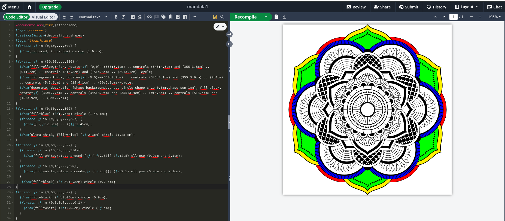
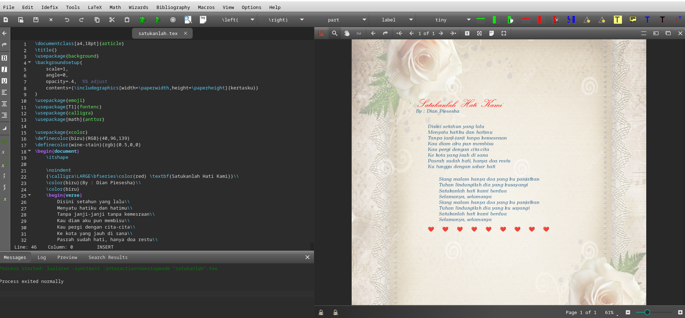


Kompilasi ini merupakan proses menerjemahkan perintah LaTeX menjadi dokumen siap cetak.  
Artikel ini membahas cara kerja kompilasi LaTeX, jenis *compiler* yang tersedia, urutan proses, hingga penyelesaian error secara efisien.


---


## Pendahuluan

LaTeX adalah sistem penataan dokumen yang menghasilkan keluaran berkualitas tinggi, terutama untuk teks ilmiah dan teknis.  
Namun, tidak seperti pengolah kata konvensional, dokumen LaTeX **harus dikompilasi** terlebih dahulu agar file `.tex` dapat berubah menjadi format akhir seperti `.pdf`, `.dvi`, atau `.ps`.


**Catatan**: Artikel ini dihasilkan dengan bantuan teknologi AI dan telah direview secara manual untuk memastikan keakuratan dan kejelasan informasi.


---

## Apa Itu Kompilasi LaTeX?

Kompilasi LaTeX adalah proses yang dilakukan oleh *compiler* untuk membaca file sumber (biasanya berekstensi `.tex`), menafsirkan perintah di dalamnya (`\section{}`, `\usepackage{}`, dll.), dan menghasilkan file keluaran seperti `.pdf`.

Sederhananya:

```
dokumen.tex → [compiler] → dokumen.pdf
```

Proses ini berbeda dengan *word processor* biasa seperti Microsoft Word, karena LaTeX memisahkan antara **penulisan konten** dan **proses pembuatan output**.

---

## Jenis Compiler LaTeX

Berikut beberapa compiler yang umum digunakan:

| Compiler | Output Utama | Kelebihan | Kekurangan |
|-----------|---------------|------------|-------------|
| **pdfLaTeX** | PDF langsung | Cepat, stabil, kompatibel dengan banyak paket | Terbatas pada font berbasis TeX dan input ASCII |
| **XeLaTeX** | PDF | Mendukung Unicode dan font sistem (TTF/OTF) | Sedikit lebih lambat |
| **LuaLaTeX** | PDF | Mendukung skrip Lua, performa tinggi | Kurang stabil pada paket lama |
| **LaTeX → DVI → PS → PDF** | PDF/DVI | Metode klasik, cocok untuk proyek lama | Proses panjang dan jarang dipakai sekarang |

> 💡 **Rekomendasi:** Gunakan `pdfLaTeX` untuk dokumen standar, `XeLaTeX` untuk bahasa non-Latin (seperti Indonesia, Jepang, Arab), dan `LuaLaTeX` untuk proyek dengan grafik atau skrip kompleks.

---

## Proses Kompilasi Dokumen

Ketika menjalankan kompilasi, sistem LaTeX melalui beberapa tahap:

1. **Membaca file `.tex`** — compiler memproses preamble (`\usepackage{}`) dan isi dokumen.
2. **Membangun struktur dokumen** — membuat daftar isi, label, referensi, dan indeks.
3. **Menyusun simbol matematika, gambar, dan tabel.**
4. **Menulis file bantu (auxiliary)** seperti:
   - `.aux` → untuk referensi silang (`\ref`, `\cite`)
   - `.toc` → untuk daftar isi (*table of contents*)
   - `.log` → untuk catatan error
5. **Menghasilkan file akhir (`.pdf` atau `.dvi`).**

Karena adanya file bantu, **dokumen LaTeX sering perlu dikompilasi lebih dari sekali**, terutama jika menggunakan referensi silang, daftar isi, atau bibliografi.

---

## Perintah Kompilasi di Terminal

Untuk pengguna sistem lokal (Windows, macOS, Linux), kompilasi bisa dilakukan melalui *command line*.

Contoh:

```bash
pdflatex dokumen.tex
bibtex dokumen
pdflatex dokumen.tex
pdflatex dokumen.tex
```

Langkah-langkah di atas:
1. Kompilasi pertama: menghasilkan `.aux` dan `.toc`.
2. Jalankan `bibtex` (jika ada daftar pustaka).
3. Kompilasi ulang untuk memperbarui referensi.
4. Kompilasi terakhir untuk hasil final.

> ⚙️ Jika menggunakan `biber` (dengan `biblatex`), ganti `bibtex` dengan `biber dokumen`.

---

## Kompilasi di Lingkungan Editor

Selain terminal, kompilasi bisa dilakukan langsung dari editor LaTeX. Berikut beberapa opsi umum:



### Overleaf (Online)
- Kompilasi otomatis setiap kali Anda menyimpan.
- Pilih compiler di menu **Menu → Compiler → pdfLaTeX/XeLaTeX**.
- Tidak memerlukan instalasi lokal.

### TeXworks / TeXstudio (Offline)
- Tekan **Ctrl + T** atau klik ikon “Typeset”.
- Dapat memilih compiler dari daftar dropdown.
- Cocok untuk pengguna Windows/macOS.



### Visual Studio Code + LaTeX Workshop
- Ekstensi populer untuk pengguna modern.
- Mendukung fitur “build chain” (urutan otomatis pdflatex → bibtex → pdflatex → pdflatex).
- File konfigurasi: `.vscode/settings.json`

Contoh pengaturan build:

```json
"latex-workshop.latex.recipes": [
  {
    "name": "pdflatex -> bibtex -> pdflatex x2",
    "tools": ["pdflatex", "bibtex", "pdflatex", "pdflatex"]
  }
]
```

---

## Penanganan Error Umum

Berikut daftar kesalahan umum saat kompilasi beserta solusinya:

| Pesan Error | Penyebab | Solusi |
|--------------|-----------|---------|
| `! Undefined control sequence.` | Perintah tidak dikenali | Pastikan paket yang diperlukan sudah dimuat (`\usepackage{}`) |
| `! LaTeX Error: File 'xxx.sty' not found.` | Paket belum terinstal | Instal melalui manajer paket (`tlmgr install xxx`) |
| `! Missing $ inserted.` | Kesalahan dalam mode matematika | Pastikan rumus diapit `$...$` atau `\[...\]` |
| `Package hyperref Warning: Token not allowed in a PDF string` | Ada karakter tak valid di hyperlink | Gunakan `{}` atau ubah karakter khusus |
| Output tidak lengkap / referensi kosong | Kompilasi belum dilakukan beberapa kali | Ulangi kompilasi 2–3 kali |

> 🧩 Tip: Baca file `dokumen.log` untuk melihat pesan error rinci dan lokasi baris bermasalah.

---

## Workflow Modern dan Otomatisasi

Untuk efisiensi, banyak pengguna kini mengandalkan **alat otomatisasi kompilasi**, seperti:

- **latexmk** — menjalankan semua tahap kompilasi (LaTeX, BibTeX, indeks) secara otomatis.  
  Contoh:  
  ```bash
  latexmk -pdf dokumen.tex
  ```
- **arara** — sistem build berbasis perintah komentar di file `.tex`.  
  Contoh di preamble:  
  ```latex
  % arara: pdflatex
  % arara: bibtex
  % arara: pdflatex
  % arara: pdflatex
  ```
- **Makefile** — untuk proyek besar dengan banyak file `.tex`.

Dengan workflow otomatis ini, Anda cukup menjalankan satu perintah dan seluruh proses akan berjalan sesuai urutan yang benar.

---

## Kesimpulan

Kompilasi adalah inti dari sistem LaTeX — proses yang mengubah kode sumber menjadi dokumen berkualitas tinggi.  
Memahami cara kerja *compiler*, urutan build, serta penanganan error akan sangat membantu dalam menulis dokumen ilmiah secara efisien dan profesional.

Baik menggunakan Overleaf, VS Code, atau terminal, prinsip utamanya tetap sama: **pastikan semua paket, referensi, dan sumber sudah siap sebelum kompilasi akhir.**

---

### Referensi

- The LaTeX Project. [https://www.latex-project.org](https://www.latex-project.org)  
- Overleaf Documentation – *Understanding PDF Compilation*  
  [https://www.overleaf.com/learn/latex](https://www.overleaf.com/learn/latex)  
- TeX Users Group (TUG). *LaTeX Compilation Workflow*.  
  [https://tug.org](https://tug.org)  
- Wikibooks. *LaTeX/Installing and Compiling*.  
  [https://en.wikibooks.org/wiki/LaTeX/Installing_and_Compiling](https://en.wikibooks.org/wiki/LaTeX/Installing_and_Compiling)

---


