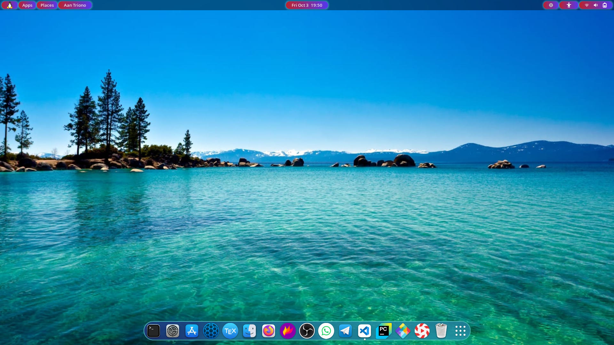

This article discusses the reasons for migrating from Windows to Linux.

<!--more-->

It’s been 3 years since I started using Linux as my primary operating system for everyday work. It all began from the realization of the risks and ethical concerns of using **pirated** or **cracked** software on Windows.

Through learning, both physically and digitally, and interacting with various Linux communities across the internet and Telegram, I was motivated to migrate from Windows to Linux. That’s when I decided to take Linux seriously.

Ubuntu was the first Linux distribution I tried. There was a **different feeling** seeing a desktop that looked unfamiliar compared to Windows. My curiosity grew instantly — many questions appeared that needed answers. Exploring deeper, I found **LibreOffice** as the default office suite, including Writer, Calc, Impress, Draw, Math, and Base.

Was it difficult to use Linux applications at first? Of course — anything new requires **adaptation and patience**. 😄

As a new Linux user, I experienced what’s called **“distro hopping.”** This term refers to the habit of frequently switching between Linux distributions in a short period. Some of the distros I’ve tried include:

* Debian  
* Ubuntu  
* MX Linux  
* Antix  
* Deepin  
* Arch  
* Endeavour  
* Mabox  
* Langit Ketujuh  
* Garuda  
* Fedora  

I also had a chance to try Unix-based systems such as:  

* FreeBSD  
* GhostBSD  

Even though I’ve switched between many distros, my Linux skill level… well, still about the same 😅  

Here’s a look at the desktop from the Linux distro I currently use. Guess which one?  

---

## It’s Free  

Linux is completely **free**. You don’t need to pay for any license, except for enterprise editions like **Red Hat Enterprise Linux (RHEL)** or **SUSE Linux Enterprise**.

Unlike Windows, Linux doesn’t bother you with “Activate Windows” messages or require pirated patches that could contain malware.  

---

## More Secure  

Every OS has its vulnerabilities, but Linux is known as one of the **most secure operating systems**.  

Windows systems are notorious for being targeted by malware and viruses, while Linux is inherently more secure — not invincible, but **much harder to exploit**.  

Linux’s package management, repository-based software system, and permission model all contribute to its strong security. You don’t even need antivirus software in most cases, saving money and resources.  

---

## Open Source  

Using a closed-source OS is like buying a car but never being allowed to open the hood. With Linux, you can see everything under the hood — it’s **fully open source**.  

Even if most users won’t read the source code, the openness ensures **transparency and trust**. Developers can inspect, modify, and improve Linux freely.  

---

## Lightweight on Low-End Hardware  

As operating systems evolve, hardware requirements also increase dramatically. For example, Windows 10 or 11 needs at least **8 GB of RAM** for smooth performance, ideally 16 GB.  

In contrast, Linux can run smoothly on **older or low-spec computers**. Many lightweight distros like **Xubuntu, Lubuntu, or MX Linux** can revive old machines efficiently.  

---

## Highly Customizable  

Customization is one of Linux’s biggest strengths. If you love to tweak your desktop’s look and feel, Linux is the best choice.  

Different desktop environments offer unique experiences:  

- **GNOME** – simple, elegant, and modern.  
- **KDE Plasma** – extremely customizable and full of features.  
- **Cinnamon, Budgie, Xfce** – great alternatives for different preferences.  

You can even apply new icon themes, widgets, and wallpapers — or use **Conky** to display real-time system info right on your desktop.  

---

## Perfect for Programmers  

Linux supports almost every major programming language (Python, C/C++, Java, Perl, Ruby, etc.) and provides built-in development tools.  

The **Linux terminal** is far more powerful than Windows’ command prompt. Package managers like `apt` and `dnf` make software installation effortless.  

Moreover, Linux has built-in **SSH support**, ideal for managing servers. That’s why most developers and DevOps professionals prefer Linux-based environments.  

---

## Built-in “App Store”  

Installing software on Linux is easy thanks to **Software Centers** (like GNOME Software or KDE Discover).  

Most apps you’ll ever need are available directly from official repositories. Modern distros also support **Flatpak, Snap, and AppImage**, making software installation consistent and reliable.  

---

## Many Distributions to Choose From  

Unlike Windows, Linux isn’t just one OS — it’s a whole family of **distributions (distros)** tailored to different needs.  

- Security testing? Try **Kali Linux**.  
- Programming? Try **Ubuntu** or **Fedora**.  
- Old hardware? Try **Puppy Linux** or **Lubuntu**.  

There’s a Linux distro for everyone.  

---

## Reliability  

Windows tends to slow down over time, sometimes requiring a full reinstall. Linux, however, remains fast and stable for years.  

You rarely need to reboot Linux, except for kernel updates. With Windows, almost every small change requires a restart — install software, uninstall, update, reboot!  

That’s why Linux powers most of the world’s **web servers, supercomputers, and tech giants** like Google and Facebook.  

---

## Supportive Community  

You don’t need to hire a technician to fix Linux problems. The Linux community is incredibly active and helpful.  

Just search forums, ask on Telegram groups, Reddit, or StackExchange — and you’ll likely get friendly, detailed help for free.  

---

## Conclusion  

Those were my **reasons for switching from Windows to Linux** as my main operating system.  

Sure, Linux still has limitations — mainly with certain proprietary apps or games — but support is growing fast. More developers are creating native Linux versions every year.  

If you’re curious, give Linux a try. You might just find your own reasons to stay.  

---

👉 So, are you ready to try Linux?  
