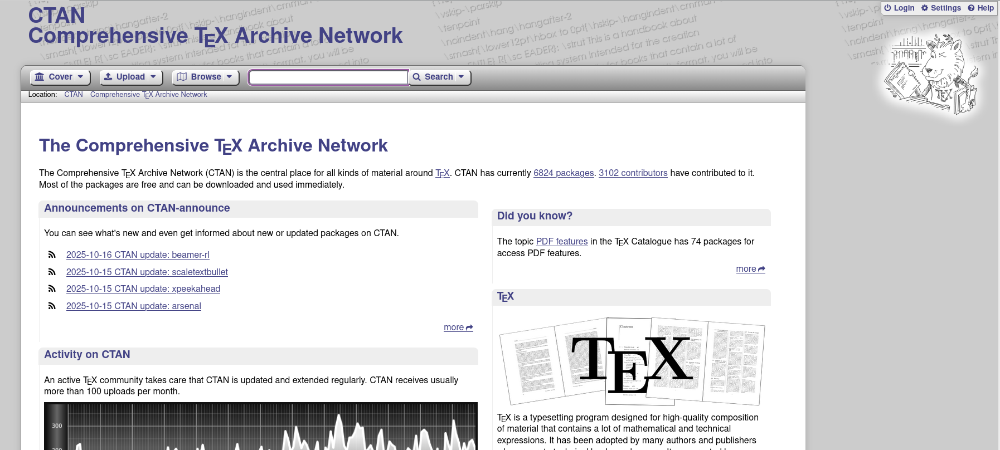

This article discusses the concepts, types, and functions of packages in LaTeX.

---

<!--more-->



LaTeX is a typesetting system that has become the de facto standard in the academic and scientific research world. One of LaTeX's main advantages is its flexibility through the use of **packages** — additional modules that extend the core system's capabilities. This article comprehensively discusses the concepts, functions, and management of packages in LaTeX, complete with real-world application examples for academic documents such as theses and dissertations. Additionally, this article highlights common issues like package conflicts and provides practical solutions to address them.


---

## Introduction

In the world of scientific writing, LaTeX is known for its ability to produce precise, consistent, and aesthetic documents. However, the true power of LaTeX lies not only in its core engine but in the **thousands of additional packages** that provide advanced functionality.

According to *Wayne State University Libraries (2024)*, LaTeX packages are extension components that facilitate users in managing elements such as mathematics, graphics, bibliographic references, and page layout. Without these packages, users would have to write code from scratch for every desired feature — something inefficient and prone to errors.

---

## Basic Concepts of LaTeX Packages

### What is a Package?

A package is a collection of additional macros and commands that extend LaTeX's basic functions. Package files typically have the `.sty` extension and are activated using the command:
```latex
\usepackage[options]{package-name}
```

This command is written **in the preamble section**, the area before `\begin{document}`. Example:
```latex
\documentclass{article}
\usepackage{amsmath}
\usepackage{graphicx}
\usepackage[margin=1in]{geometry}
\begin{document}
...
\end{document}
```

Each package has its own documentation that can be found on **CTAN (Comprehensive TeX Archive Network)**, the primary source for LaTeX packages worldwide.



---

## Types and Functions of Popular Packages

| Package Name | Main Function | Example Usage |
|--------------|---------------|---------------|
| **amsmath**, **amssymb** | Provides advanced mathematical symbols and environments | Writing complex equations, matrices, integrals |
| **graphicx** | Inserts external images (PNG, JPG, PDF) | `\includegraphics[width=0.5\textwidth]{image.png}` |
| **geometry** | Adjusts margins and page size | `\usepackage[margin=1in]{geometry}` |
| **hyperref** | Adds hyperlinks and PDF metadata | `\usepackage[colorlinks=true]{hyperref}` |
| **biblatex** / **natbib** | Manages automatic citations and bibliography | `\usepackage[backend=biber,style=apa]{biblatex}` |
| **tikz**, **pgfplots** | Creates vector graphics and diagrams directly in LaTeX | Scientific diagrams, workflows, data graphs |
| **cleveref** | Simplifies cross-referencing | `\cref{label}` for automatic references |
| **xcolor** | Controls text colors and page elements | Text highlighting or colored tables |

---

## Case Study 1: Preamble for Thesis or Dissertation

The preamble is the most crucial part of an academic document as it determines page format, font type, and citation style. Here's an example preamble commonly used in university academic works:
```latex
\documentclass[12pt,a4paper]{report}

% Language and encoding
\usepackage[utf8]{inputenc}
\usepackage[T1]{fontenc}
\usepackage[english]{babel}

% Page layout
\usepackage[margin=3cm]{geometry}

% Mathematics and science packages
\usepackage{amsmath, amssymb, amsthm}
\usepackage{siunitx}

% Graphics and tables
\usepackage{graphicx}
\usepackage{booktabs}
\usepackage{caption}
\usepackage{subcaption}

% Citations and bibliography
\usepackage[backend=biber,style=apa]{biblatex}
\addbibresource{bibliography.bib}

% Hyperlinks and PDF metadata
\usepackage[hidelinks]{hyperref}
\hypersetup{
  pdfauthor={Author Name},
  pdftitle={Thesis or Dissertation Title},
  pdfsubject={Academic Document},
  pdfkeywords={LaTeX, Thesis, Packages, Academic}
}

\begin{document}
...
\end{document}
```

💡 *Tips:*  
Use a modular approach by storing the preamble section in a separate file (`preamble.tex`) for easy maintenance and reuse across various projects.

---

## Case Study 2: Resolving Conflicts Between `hyperref` and `geometry` Packages

One of the most common issues in LaTeX documents is **package conflicts**, especially between `hyperref` and `geometry`. Both packages often manage page layout elements and PDF metadata, which can cause error messages like:
```
Option clash for package geometry
```

### Solution:
1. **Call `geometry` before `hyperref`**, because `hyperref` reads existing layout settings.
2. Use configuration like this:
```latex
\usepackage[margin=1in]{geometry}
\usepackage[colorlinks=true, linkcolor=blue]{hyperref}
```

3. Avoid calling `geometry` again after `hyperref`. If you need to change margins mid-document, use:
```latex
   \newgeometry{margin=2cm}
```

This way, option conflicts will be avoided and hyperlinks will function properly without changing the page format.

---

## Recommended Best Practices

1. **Use only necessary packages** to maintain document stability.  
2. **Update LaTeX distribution** (TeX Live, MiKTeX) regularly to get the latest package versions.  
3. **Read official documentation** for each package on CTAN before use.  
4. **Pay attention to loading order**, especially for packages that modify page appearance or references.  
5. **Use comments** in the preamble to explain each package's function for future understanding.  

Example of good commenting:
```latex
% Packages for advanced mathematics formatting
\usepackage{amsmath, amssymb}
```

---

## Conclusion

LaTeX packages are the backbone of the LaTeX system's flexibility. By understanding how they work, their loading structure, and potential inter-package conflicts, users can create neat, professional, and efficient academic documents. Whether for theses, dissertations, or scientific publications, mastering packages is a crucial step toward optimal productivity in the digital academic environment.

---

## References

- Wayne State University Libraries. *How to Use LaTeX: Packages.*  
  [https://guides.lib.wayne.edu/latex/packages](https://guides.lib.wayne.edu/latex/packages)  
- The LaTeX Project. *CTAN: Comprehensive TeX Archive Network.*  
  [https://ctan.org](https://ctan.org)  
- Overleaf Documentation. *LaTeX Packages and Configuration.*  
  [https://www.overleaf.com/learn](https://www.overleaf.com/learn)  
- StackExchange LaTeX Community. *Common Package Conflicts and Solutions.*  
  [https://tex.stackexchange.com](https://tex.stackexchange.com)