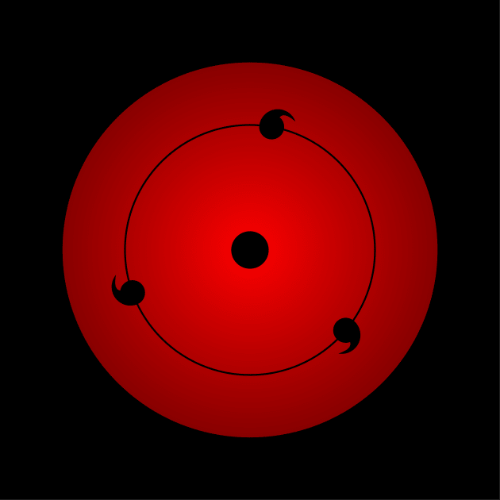
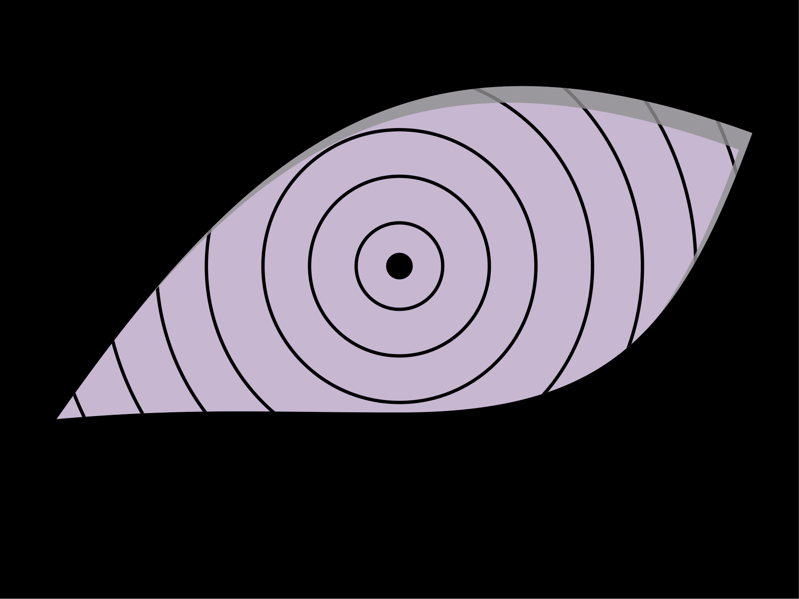

This article discusses how to draw sharingan and rinnegan eyes from **Anime Series: Naruto Shippuden** using LaTeX, with the main package used being Tikz package.

---

<!--more-->

> In the *Naruto* anime series, there are several types of eye *jutsu*. **Rinnegan** and **Sharingan** are two of the three most dangerous *Dōjutsu* or eye techniques. Both are rare *Kekkei Genkai* that can only be possessed by specific individuals.
> 
> Sharingan is the characteristic *Dōjutsu* of the Uchiha clan that allows its users to copy various techniques (*jutsu*) such as *ninjutsu*, *genjutsu*, and *taijutsu*. Meanwhile, **Rinnegan** appears when the powers of *Indra Otsutsuki* and *Asura Otsutsuki* are combined. The main power of Rinnegan is the ability to master life and death — it can even extract a person's soul in a matter of seconds.

## Introduction
In this article, we will learn how to draw **Sharingan** and **Rinnegan** eyes using **LaTeX**.  
The main package required is `TikZ` along with the `fadings` library. For coloring, we use the `\definecolor` command.

---

## Sharingan
There are several types of Sharingan in the *Naruto* series:  
- Sharingan with Tomoe  
- Mangekyō Sharingan  
- Eternal Mangekyō Sharingan  

We will draw the **basic Sharingan with three Tomoe**, belonging to the Uchiha clan.

### Steps:
1. Use the `standalone` document class with `tikz` option:

    ```latex
    \documentclass[tikz]{standalone}
    ```

2. Load TikZ library and create fading effect:

    ```latex
    \usetikzlibrary{fadings}
    \tikzfading[name=mripate sasuke, inner color=transparent!0, outer color=transparent!40]
    ```

3. Start drawing in `tikzpicture` environment:

    ```latex
    \begin{tikzpicture}
    ...
    \end{tikzpicture}
    ```

4. Create black square as background:

    ```latex
    \fill[black] (-4,-4) rectangle (4,4);
    ```

5. Create main red circle (eye):

    ```latex
    \fill[red, path fading=mripate sasuke] (0,0) circle (3);
    ```

6. Add inner black circle and eye center:

    ```latex
    \draw[thick] (0,0) circle (2);
    \fill (0,0) circle (0.3);
    ```

7. Create three Tomoe around the eye:

    ```latex
    \foreach\i in {80,200,320}
    \fill[rotate=\i] (2,0) ++ (-30:0.2)
      arc (330:90:0.2) arc (90:-60:0.3) to[out=60,in=-30] cycle;
    ```

8. Close document:

    ```latex
    \end{document}
    ```

**Final Result:**



---

## Rinnegan
Rinnegan is formed from the combination of *Indra* and *Asura Otsutsuki's* powers, granting **Six Paths Power** — six different abilities that can be used even by the user's other bodies (such as *Pain* and *Obito*).

### Steps:
1. Use the `standalone` document class:

    ```latex
    \documentclass[tikz]{standalone}
    ```

2. Define colors and basic shapes:

    ```latex
    \definecolor{rinnegan}{HTML}{C7B7D1}
    \newcommand{\mripaterinnegan}{
      (-10.3,-4.6) to[out=5,in=180] (0,-4.4)
      to[out=0,in=250,looseness=1.2] (10.6,4)
      to[out=160,in=55,looseness=1.2] cycle;
    }
    ```

3. Create main drawing in `tikzpicture`:

    ```latex
    \begin{tikzpicture}
    ...
    \end{tikzpicture}
    ```

4. Draw Rinnegan eye pattern and center circle:

    ```latex
    \fill[rinnegan]\mripaterinnegan;
    \fill (0,0) circle (0.4);
    ```

5. Add circular lines inside the eye:

    ```latex
    \begin{scope}
      \clip\mripaterinnegan;
      \foreach\i in {1.3,2.7,4.1,5.8,7.3,8.9,10.5}
        \draw (0,0) circle (\i);
      \fill[gray,fill opacity=0.8,shift={(-0.4,-0.5)},even odd rule]
        (-12,-6) rectangle (12,6) \mripaterinnegan;
    \end{scope}
    ```

6. Darken the area outside the eye:

    ```latex
    \fill[even odd rule] (-12,-10) rectangle (12,8) \mripaterinnegan;
    ```

7. Close document:

    ```latex
    \end{document}
    ```

**Final Result:**  



---

## Conclusion
Through this exercise, we learned to draw unique symbols from the *Naruto* world mathematically using **LaTeX** and **TikZ**.  
This process demonstrates how coordinates, points, lines, and planes work together to form precise and aesthetic images — in accordance with the principles of *geometry* and *TeX* logic. Interesting, isn't it, drawing with LaTeX. &#x1F604;

---

## References
1. *Drawing of Sharingan and Rinnegan Eyes.*  
   [https://tex.stackexchange.com/questions/680546/drawing-of-sharingan-and-rinnegan-eyes](https://tex.stackexchange.com/questions/680546/drawing-of-sharingan-and-rinnegan-eyes)  
   (Accessed on March 24, 2023)

2. *Sharingan vs Rinnegan: Which One is Stronger.*  
   [https://www.greenscene.co.id/2020/08/17/naruto-sharingan-vs-rinnegan-mana-yang-lebih-kuat/](https://www.greenscene.co.id/2020/08/17/naruto-sharingan-vs-rinnegan-mana-yang-lebih-kuat/)  
   (Accessed on March 25, 2023)

---