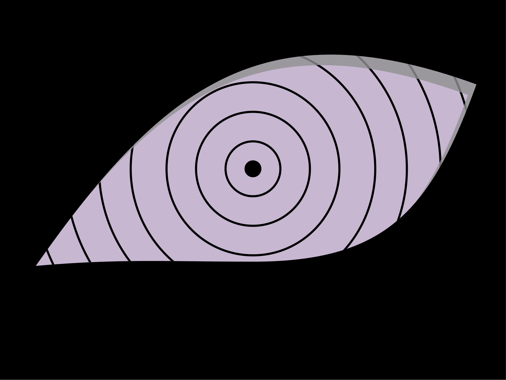

Artikel ini membahas tentang cara menggambar mata sharingan dan rinnegan di **Serial Anime: Naruto Shippuden** menggunakan LaTeX dengan paket utama yang digunakan adalah paket Tikz.

---

<!--more-->


> Dalam serial anime *Naruto*, terdapat beberapa jenis *jutsu* mata. **Rinnegan** dan **Sharingan** adalah dua dari tiga *Dōjutsu* atau *jutsu* mata yang paling berbahaya. Keduanya merupakan *Kekkei Genkai* langka yang hanya bisa dimiliki oleh orang tertentu. 
> Sharingan adalah *Dōjutsu* khas klan Uchiha yang memungkinkan penggunanya menirukan berbagai teknik (*jutsu*) seperti *ninjutsu*, *genjutsu*, dan *taijutsu*. Sementara itu, **Rinnegan** muncul ketika kekuatan *Indra Otsutsuki* dan *Asura Otsutsuki* dikombinasikan. Kekuatan utama Rinnegan adalah kemampuan menguasai kematian dan kehidupan — bahkan dapat mengeluarkan jiwa seseorang hanya dalam hitungan detik.

## Pengantar
Dalam artikel ini, kita akan mempelajari cara menggambar mata **Sharingan** dan **Rinnegan** menggunakan **LaTeX**.  
Paket utama yang dibutuhkan adalah `TikZ` beserta pustaka `fadings`. Untuk pewarnaan, kita menggunakan perintah `\definecolor`.

---

## Sharingan
Terdapat beberapa jenis Sharingan di serial *Naruto*:  
- Sharingan dengan Tomoe  
- Mangekyō Sharingan  
- Eternal Mangekyō Sharingan  

Kita akan menggambar **Sharingan dasar dengan tiga Tomoe**, milik klan Uchiha.

### Langkah-langkah:
1. Gunakan kelas dokumen `standalone` dengan opsi `tikz`:

    ```latex
    \documentclass[tikz]{standalone}
    ```

2. Panggil pustaka TikZ dan buat *fading effect*:

    ```latex
    \usetikzlibrary{fadings}
    \tikzfading[name=mripate sasuke, inner color=transparent!0, outer color=transparent!40]
    ```

3. Mulai menggambar dalam lingkungan `tikzpicture`:

    ```latex
    \begin{tikzpicture}
    ...
    \end{tikzpicture}
    ```

4. Buat persegi hitam sebagai latar:

    ```latex
    \fill[black] (-4,-4) rectangle (4,4);
    ```

5. Buat lingkaran merah utama (mata):

    ```latex
    \fill[red, path fading=mripate sasuke] (0,0) circle (3);
    ```

6. Tambahkan lingkaran hitam dalam dan pusat mata:

    ```latex
    \draw[thick] (0,0) circle (2);
    \fill (0,0) circle (0.3);
    ```

7. Buat tiga Tomoe di sekeliling mata:

    ```latex
    \foreach\i in {80,200,320}
    \fill[rotate=\i] (2,0) ++ (-30:0.2)
      arc (330:90:0.2) arc (90:-60:0.3) to[out=60,in=-30] cycle;
    ```

8. Tutup dokumen:

    ```latex
    \end{document}
    ```

**Hasil akhir:**


---

## Rinnegan
Rinnegan terbentuk dari kombinasi kekuatan *Indra* dan *Asura Otsutsuki*, memberikan kemampuan **Six Paths Power** — enam kekuatan berbeda yang bisa digunakan bahkan oleh tubuh lain dari penggunanya (contohnya *Pain* dan *Obito*).

### Langkah-langkah:
1. Gunakan kelas dokumen `standalone`:

    ```latex
    \documentclass[tikz]{standalone}
    ```

2. Tentukan warna dan bentuk dasar:

    ```latex
    \definecolor{rinnegan}{HTML}{C7B7D1}
    \newcommand{\mripaterinnegan}{
      (-10.3,-4.6) to[out=5,in=180] (0,-4.4)
      to[out=0,in=250,looseness=1.2] (10.6,4)
      to[out=160,in=55,looseness=1.2] cycle;
    }
    ```

3. Buat gambar utama dalam `tikzpicture`:

    ```latex
    \begin{tikzpicture}
    ...
    \end{tikzpicture}
    ```

4. Gambar pola mata Rinnegan dan lingkaran pusat:

    ```latex
    \fill[rinnegan]\mripaterinnegan;
    \fill (0,0) circle (0.4);
    ```

5. Tambahkan garis-garis melingkar di dalam mata:

    ```latex
    \begin{scope}
      \clip\mripaterinnegan;
      \foreach\i in {1.3,2.7,4.1,5.8,7.3,8.9,10.5}
        \draw (0,0) circle (\i);
      \fill[gray,fill opacity=0.8,shift={(-0.4,-0.5)},even odd rule]
        (-12,-6) rectangle (12,6) \mripaterinnegan;
    \end{scope}
    ```

6. Gelapkan area luar mata:

    ```latex
    \fill[even odd rule] (-12,-10) rectangle (12,8) \mripaterinnegan;
    ```

7. Tutup dokumen:

    ```latex
    \end{document}
    ```

**Hasil akhir:**  



---

## Kesimpulan
Melalui latihan ini, kita belajar menggambar simbol-simbol unik dari dunia *Naruto* dengan cara matematis menggunakan **LaTeX** dan **TikZ**.  
Proses ini menunjukkan bagaimana koordinat, titik, garis, dan bidang bekerja sama membentuk sebuah gambar yang presisi dan estetis — sesuai dengan prinsip *geometri* dan logika *TeX*. Menarik bukan menggambar dengan LaTeX. &#x1F604;

---

## Pustaka
1. *Drawing of Sharingan and Rinnegan Eyes.*  
   [https://tex.stackexchange.com/questions/680546/drawing-of-sharingan-and-rinnegan-eyes](https://tex.stackexchange.com/questions/680546/drawing-of-sharingan-and-rinnegan-eyes)  
   (Diakses pada 24 Maret 2023)

2. *Sharingan vs Rinnegan: Mana yang Lebih Kuat.*  
   [https://www.greenscene.co.id/2020/08/17/naruto-sharingan-vs-rinnegan-mana-yang-lebih-kuat/](https://www.greenscene.co.id/2020/08/17/naruto-sharingan-vs-rinnegan-mana-yang-lebih-kuat/)  
   (Diakses pada 25 Maret 2023)

---


