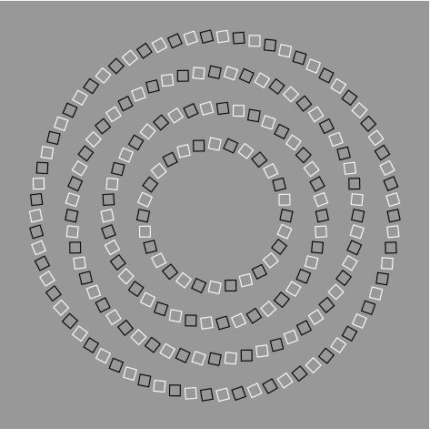

This article explores how an **arrangement of squares** can form a rotating circular illusion using **LaTeX and TikZ**. We will examine the structure of the code, the visual principles behind the illusion, and its significance in perception and visual art.

---

<!--more-->

## Introduction

In the world of visual perception, **optical illusions** are fascinating phenomena that reveal how the human brain interprets visual information. One such illusion is the **circle illusion**, where simple geometric patterns can create the impression of motion or form that does not actually exist.

This article explores how an **arrangement of squares** can form a rotating circular illusion using **LaTeX and TikZ**. We will examine the structure of the code, the visual principles behind the illusion, and its significance in perception and visual art.

---

## LaTeX Source Code

The following image is generated using **TikZ**, a powerful LaTeX graphics library designed for mathematical and scientific illustrations.

```latex
\documentclass{standalone}
\usepackage{tikz}
\begin{document}

\begin{tikzpicture}
  \fill[color=black!40!white] (-6,-6) rectangle (6,6);
  \foreach \n/\r/\twist in {70/5/12,56/4/-12,42/3/12,28/2/-12}{
    \foreach \m in {1,3,...,\n}
      \draw [thick,color=white,shift={(360/\n*\m:\r)},rotate=\twist+360/\n*\m]
        (-.15,-.15) rectangle (.15,.15);
    \foreach \m in {2,4,...,\n}
      \draw [thick,color=black,shift={(360/\n*\m:\r)},rotate=\twist+360/\n*\m]
        (-.15,-.15) rectangle (.15,.15);
    }
\end{tikzpicture}

\end{document}
```

---
The output produced:



## Code Structure Explanation

This section explains each component of the code so you can understand how the pattern is constructed step by step.

### **Document Class**
```latex
\documentclass{standalone}
```
The `standalone` class allows you to compile only the figure without page margins or text. This is ideal for creating diagrams or standalone graphics.

---

### **Loading the TikZ Package**
```latex
\usepackage{tikz}
```
TikZ (short for *"TikZ ist kein Zeichenprogramm"*) is a LaTeX library for vector graphics, providing precise control over shapes, colors, and geometric transformations.

---

### **TikZ Picture Environment**
```latex
\begin{tikzpicture}
  ...
\end{tikzpicture}
```
All TikZ drawing commands are placed inside this environment. Within this block, we define all visual elements—background, shapes, colors, and loops.

---

### **Background**
```latex
\fill[color=black!40!white] (-6,-6) rectangle (6,6);
```
The `\fill` command fills a rectangular area with a color.  
`black!40!white` means **40% black mixed with white**, producing a neutral gray background.  
Coordinates `(-6,-6)` to `(6,6)` define the drawing area.

This gray background enhances contrast between black and white squares.

---

### **Main Loop for Circular Layers**
```latex
\foreach \n/\r/\twist in {70/5/12,56/4/-12,42/3/12,28/2/-12}{
  ...
}
```
This line defines the core structure of the pattern.  
- `\n` = number of squares in one ring  
- `\r` = radius (distance from the center)  
- `\twist` = rotation angle for each layer  

With four combinations, we get **four concentric circular layers**, each with a slightly different rotation. The alternating `12` and `-12` twist values make the outer and inner layers appear to rotate in opposite directions.

---

### **White Squares**
```latex
\foreach \m in {1,3,...,\n}
  \draw [thick,color=white,shift={(360/\n*\m:\r)},rotate=\twist+360/\n*\m]
    (-.15,-.15) rectangle (.15,.15);
```
This loop draws **white squares** at odd positions (1, 3, 5, ...).  
Explanation:
- `360/\n*\m` determines each square’s angular position.  
- `shift={(...:\r)}` places the square along the circle’s radius.  
- `rotate=\twist+360/\n*\m` sets the orientation of each square.  
- The coordinates define the square’s size centered at its position.

---

### **Black Squares**
```latex
\foreach \m in {2,4,...,\n}
  \draw [thick,color=black,shift={(360/\n*\m:\r)},rotate=\twist+360/\n*\m]
    (-.15,-.15) rectangle (.15,.15);
```
This loop draws **black squares** in even positions, alternating with the white ones. The contrast between them is the foundation of the optical illusion.

---

### **Closing the Environment**
```latex
\end{tikzpicture}
\end{document}
```
These commands close the TikZ and LaTeX document environments. The result is **a symmetric composition of black and white square rings** that appear to rotate when viewed carefully.

---

## The Optical Illusion Explained

1. **Color Contrast** — The alternating black and white squares cause high luminance contrast, triggering visual sensitivity in the retina.  
2. **Gradual Rotation** — The slightly different twist angles between layers create the illusion of counter-rotating rings.  
3. **Microsaccades** — Tiny involuntary eye movements make static patterns appear to move, reinforcing the illusion.

---

## Experimenting with Parameters

You can modify several parameters to create new visual effects:

| Parameter | Description | Visual Impact |
|------------|-------------|----------------|
| `\r` | Circle radius | Changes ring size |
| `\n` | Number of squares | Alters pattern density |
| `\twist` | Rotation angle | Adjusts illusion direction and strength |
| Color | Other color pairs | Affects depth and vibrancy |

Example modification:
```latex
\foreach \n/\r/\twist in {60/5/10,50/4/-10,40/3/10,30/2/-10}{
```
This creates a softer illusion with reduced contrast.

---

## Conclusion

The circle illusion beautifully demonstrates how **simple geometry** and **visual contrast** can manipulate human perception.  
With TikZ, LaTeX becomes not only a scientific writing tool but also a **creative medium** bridging art, geometry, and psychology.

---

## References

1. Gregory, R. L. (1997). *Eye and Brain: The Psychology of Seeing*. Oxford University Press.  
2. Kitaoka, A. (2003). *Rotating Snakes Illusion*. [Akiyoshi Kitaoka’s Optical Illusions](https://www.ritsumei.ac.jp/~akitaoka/).  
3. Ware, C. (2013). *Information Visualization: Perception for Design*. Morgan Kaufmann.  
4. The PGF/TikZ Manual, Version 3.1.10 (2023).  

---

**Written by:** [Aan Triono](https://www.aantriono.com)  
**License:** CC BY-SA 4.0
