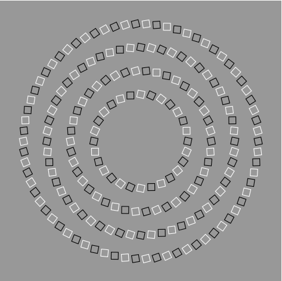

Artikel ini membahas bagaimana sebuah **susunan persegi** dapat membentuk kesan lingkaran berputar menggunakan **LaTeX dan TikZ**. Kita akan mempelajari struktur kodenya, prinsip visual yang mendasari ilusi ini, serta maknanya dalam konteks persepsi dan seni visual.

---

<!--more-->


## Pendahuluan

Dalam dunia persepsi visual, **ilusi optik** menjadi salah satu topik yang menarik untuk diteliti karena menunjukkan bagaimana otak manusia menafsirkan informasi visual. Salah satu bentuk ilusi tersebut adalah **ilusi lingkaran**, di mana pola-pola geometris sederhana dapat menciptakan kesan gerak atau bentuk yang tidak benar-benar ada.

---

## Kode Sumber LaTeX

Gambar berikut dihasilkan menggunakan kode LaTeX dengan paket **TikZ**, sebuah pustaka grafis yang sangat populer untuk menggambar objek matematis dan ilustrasi ilmiah.

```latex
\documentclass{standalone}
\usepackage{tikz}
\begin{document}

\begin{tikzpicture}
  \fill[color=black!40!white] (-6,-6) rectangle (6,6);
  \foreach \n/\r/\twist in {70/5/12,56/4/-12,42/3/12,28/2/-12}{
    \foreach \m in {1,3,...,\n}
      \draw [thick,color=white,shift={(360/\n*\m:\r)},rotate=\twist+360/\n*\m]
        (-.15,-.15) rectangle (.15,.15);
    \foreach \m in {2,4,...,\n}
      \draw [thick,color=black,shift={(360/\n*\m:\r)},rotate=\twist+360/\n*\m]
        (-.15,-.15) rectangle (.15,.15);
    }
\end{tikzpicture}

\end{document}
```
Keluaran yang dihasilkan:



---

## Penjelasan Struktur Kode

Bagian ini menjelaskan fungsi dari setiap komponen kode di atas, agar Anda memahami bagaimana pola tersebut terbentuk secara sistematis.

### 1. **Kelas Dokumen**
```latex
\documentclass{standalone}
```
Kelas dokumen `standalone` digunakan untuk membuat satu gambar saja tanpa margin dan elemen halaman. Ini ideal untuk membuat diagram atau ilustrasi terpisah yang nantinya bisa disisipkan dalam dokumen lain.

---

### **Pemanggilan Paket TikZ**
```latex
\usepackage{tikz}
```
TikZ (singkatan dari *"TikZ ist kein Zeichenprogramm"*) adalah pustaka LaTeX untuk menggambar grafik vektor menggunakan perintah berbasis teks. Ia menyediakan kontrol yang presisi terhadap bentuk, warna, dan transformasi geometri.

---

### **Lingkungan Gambar TikZ**
```latex
\begin{tikzpicture}
  ...
\end{tikzpicture}
```
Semua perintah gambar TikZ ditempatkan dalam lingkungan `tikzpicture`. Di dalam blok ini kita mendefinisikan semua elemen gambar: latar belakang, bentuk persegi, warna, dan perulangan posisi.

---

### **Latar Belakang**
```latex
\fill[color=black!40!white] (-6,-6) rectangle (6,6);
```
Perintah `\fill` digunakan untuk mengisi area persegi panjang dengan warna.  
Parameter `black!40!white` berarti **40% hitam dicampur dengan putih**, menghasilkan abu-abu netral.  
Koordinat `(-6,-6)` hingga `(6,6)` mendefinisikan batas bidang gambar.

Hasilnya adalah **latar belakang abu-abu** yang memberikan kontras terhadap persegi hitam dan putih di atasnya.

---

### **Perulangan Lapisan (Loop Utama)**
```latex
\foreach \n/\r/\twist in {70/5/12,56/4/-12,42/3/12,28/2/-12}{
  ...
}
```
Baris ini adalah inti dari struktur pola.  
- `\n` = jumlah persegi dalam satu lingkaran  
- `\r` = radius (jarak dari pusat)  
- `\twist` = sudut rotasi tambahan untuk memberi efek “berputar”

Dengan empat kombinasi nilai ini, kita mendapatkan **empat lapisan lingkaran konsentris** dengan rotasi berbeda.  
Nilai `12` dan `-12` pada parameter `\twist` bergantian menciptakan pola seolah lapisan luar dan dalam berputar ke arah berlawanan.

---

### **Persegi Putih**
```latex
\foreach \m in {1,3,...,\n}
  \draw [thick,color=white,shift={(360/\n*\m:\r)},rotate=\twist+360/\n*\m]
    (-.15,-.15) rectangle (.15,.15);
```
Loop ini menggambar **persegi putih** di posisi ganjil dari 1 hingga `\n`.  
Mari kita uraikan:
- `360/\n*\m` menentukan sudut posisi persegi di sepanjang lingkaran.
- `shift={(...:\r)}` memindahkan persegi ke radius tertentu.
- `rotate=\twist+360/\n*\m` memutar persegi sesuai orientasinya di lingkaran.
- Koordinat `(-.15,-.15)` dan `(.15,.15)` menentukan ukuran persegi kecil di sekitar titik pusatnya.

Dengan `thick` sebagai ketebalan garis, persegi tampak jelas di atas latar abu-abu.

---

### **Persegi Hitam**
```latex
\foreach \m in {2,4,...,\n}
  \draw [thick,color=black,shift={(360/\n*\m:\r)},rotate=\twist+360/\n*\m]
    (-.15,-.15) rectangle (.15,.15);
```
Perulangan ini identik dengan yang sebelumnya, namun berlaku untuk **posisi genap**.  
Artinya, persegi hitam ditempatkan di antara persegi putih, menciptakan pola **kontras bergantian** yang menjadi dasar efek ilusi.

---

### **Akhir Lingkungan dan Dokumen**
```latex
\end{tikzpicture}
\end{document}
```
Kedua perintah ini menutup lingkungan gambar dan dokumen LaTeX. Hasil akhirnya adalah **gambar simetris dengan empat cincin persegi hitam-putih yang tampak berputar** jika diamati beberapa detik.

---

## Prinsip Ilusi yang Terjadi

1. **Kontras Warna**
   Pola hitam-putih menciptakan perbedaan luminansi yang tajam, membuat mata terus menyesuaikan fokus.

2. **Rotasi Bertahap**
   Sudut `\twist` berbeda pada tiap lapisan menyebabkan persepsi rotasi arah berlawanan — efek seperti *vortex illusion*.

3. **Gerakan Mata Mikro (Microsaccade)**
   Ketika Anda menggerakkan pandangan, retina menangkap perubahan kecil yang disalahartikan sebagai gerakan nyata.

---

## Eksperimen dan Variasi

Anda dapat memodifikasi kode di atas untuk menghasilkan efek baru:

| Parameter | Deskripsi | Dampak Visual |
|------------|------------|----------------|
| `\r` | Radius lingkaran | Mengubah ukuran cincin |
| `\n` | Jumlah persegi | Menambah atau mengurangi kepadatan pola |
| `\twist` | Sudut rotasi | Mengubah arah dan intensitas ilusi rotasi |
| Warna | Kombinasi selain hitam-putih | Menimbulkan efek kedalaman berbeda |

Contoh:
```latex
\foreach \n/\r/\twist in {60/5/10,50/4/-10,40/3/10,30/2/-10}{
```
Nilai ini akan menciptakan efek yang lebih lembut dan tidak terlalu kontras.

---

## Kesimpulan

Ilusi lingkaran ini merupakan contoh menarik bagaimana **geometri sederhana** dan **kontras visual** dapat memanipulasi persepsi manusia.  
Dengan TikZ, LaTeX bukan hanya alat penulisan ilmiah, tetapi juga sarana **eksperimen artistik** yang dapat menjembatani seni dan sains.

---

## Referensi

1. Gregory, R. L. (1997). *Eye and Brain: The Psychology of Seeing*. Oxford University Press.  
2. Kitaoka, A. (2003). *Rotating Snakes Illusion*. [Akiyoshi Kitaoka’s Optical Illusions](https://www.ritsumei.ac.jp/~akitaoka/).  
3. Ware, C. (2013). *Information Visualization: Perception for Design*. Morgan Kaufmann.  
4. The PGF/TikZ Manual, Version 3.1.10 (2023).  

---

**Ditulis oleh:** [Aan Triono](https://www.aantriono.com)  
**Lisensi:** CC BY-SA 4.0
