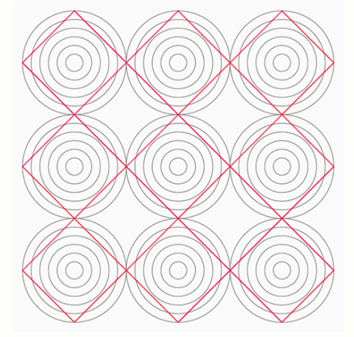

This article explores the geometric circle illusion created with LaTeX TikZ, where concentric circles and rotated squares interact to produce visual distortion despite perfect mathematical symmetry.

<!--more-->

---


**Note:** This article was generated with the help of AI technology and has been manually reviewed to ensure accuracy and clarity.



## Introduction

In the realm of visual perception, **simple geometry** can create complex illusions.  
One such case is the **concentric circle illusion**, where repeated circular patterns appear distorted when combined with **rotated square elements**.

This article explains how to construct the pattern using **LaTeX TikZ** and explores how the **human visual system** interprets these shapes, creating a misleading sense of imbalance or curvature.

---

## LaTeX Source Code

```latex
\documentclass[border=10pt,tikz]{standalone}
\pagecolor{gray!5}
\begin{document}
    \begin{tikzpicture}[x=4cm,y=4cm,every rectangle node/.style={draw,thick,red,rotate=45,minimum width=0.707*4cm,minimum height=0.707*4cm}]
        \foreach \y in {1,...,3}
            \foreach \x in {1,...,3}{%
                \foreach \diameter in {1,...,6}
                    \draw[gray,thick] (\x,\y) circle (1/12*\diameter);
                \node[rectangle] at (\x,\y) {};
            }
    \end{tikzpicture}
\end{document}
```
The output produced:


---

## Code Structure Explanation

### **Document Declaration**
```latex
\documentclass[border=10pt,tikz]{standalone}
```
The `standalone` class generates a single image without full document margins.  
`border=10pt` adds a small padding, and `tikz` loads the TikZ package for vector graphics.

---

### **Background Color**
```latex
\pagecolor{gray!5}
```
Sets a light gray background to improve contrast and visual comfort.

---

### **TikZ Environment**
```latex
\begin{tikzpicture}[x=4cm,y=4cm,...]
```
Defines the drawing area. Scaling ensures each grid unit equals 4 cm for consistent proportions.

---

### **Rectangle Node Style**
```latex
every rectangle node/.style={draw,thick,red,rotate=45,minimum width=0.707*4cm,minimum height=0.707*4cm}
```
Defines the appearance of square nodes:
- `draw,thick,red`: Draws red squares with thick borders.  
- `rotate=45`: Rotates each square by 45°, forming a diamond shape.  
- Dimensions (`0.707*4cm`) ensure proper scaling after rotation (`√2/2 × 4 cm`).

---

### **Grid of Circles**
```latex
\foreach \y in {1,...,3}
    \foreach \x in {1,...,3}{ ... }
```
Generates a 3×3 grid of circle clusters centered at coordinates (x, y).

---

### **Concentric Circles**
```latex
\foreach \diameter in {1,...,6}
    \draw[gray,thick] (\x,\y) circle (1/12*\diameter);
```
Draws six concentric circles per grid point, producing a layered depth illusion.

---

### **Square Nodes**
```latex
\node[rectangle] at (\x,\y) {};
```
Places a red rotated square at each grid center, creating a visual conflict between radial (circular) and diagonal (square) orientation — the essence of the illusion.

---

## Visual Analysis

The illusion emerges from the **interaction between circle symmetry and diagonal orientation**.  
The human eye perceives competing directional cues:

| Visual Factor | Perceptual Effect |
|----------------|------------------|
| Diagonal squares | Create tension and apparent skew |
| Concentric circles | Reinforce radial focus |
| Neutral colors | Maintain balance between shapes |

Together, they form an impression of distortion even though all elements are mathematically aligned.

---

## Experimental Variations

| Parameter | Function | Visual Impact |
|------------|-----------|---------------|
| Number of circles (`1,...,6`) | Controls layering | More circles amplify depth illusion |
| Square color | e.g., `blue` or `orange` | Alters focal emphasis |
| Rotation angle | Change to 30° or 60° | Shifts perceived distortion |
| Circle spacing | Modify `1/12` to `1/10` | Changes density and overlap |

Example variation:
```latex
\node[rectangle,draw=blue,rotate=30] at (\x,\y) {};
```

---

## Scientific and Artistic Relevance

This pattern demonstrates how **geometry influences perception**:
- **Cognitive psychology:** illustrates orientation conflict and visual interpretation.  
- **Geometric art:** transforms mathematical symmetry into aesthetic patterns.  
- **Information visualization:** helps understand alignment perception.  
- **Design:** used in architecture and optical art for dynamic compositions.

---

## Conclusion

The circle illusion shows that **perfect symmetry does not guarantee stable perception**.  
By combining **concentric geometry and diagonal rotation**, our brains fabricate curvature where none exists.  
Using **LaTeX TikZ**, such illusions can be precisely modeled — turning mathematics into visual art.

---

## References

1. Gregory, R. L. (1997). *Eye and Brain: The Psychology of Seeing.* Oxford University Press.  
2. Coren, S., & Girgus, J. S. (1978). *Seeing is Deceiving: The Psychology of Visual Illusions.* Lawrence Erlbaum.  
3. Ware, C. (2013). *Information Visualization: Perception for Design.* Morgan Kaufmann.  
4. PGF/TikZ Manual, Version 3.1.10 (2023).

---

**Written by:** [Aan Triono](https://www.aantriono.com)  
**License:** CC BY-SA 4.0
