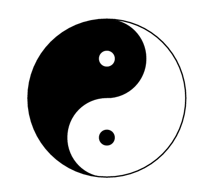

Artikel ini membahas ilusi visual berupa titik putih pada kisi hitam, di mana otak memunculkan persepsi kontras yang tidak nyata. Dibuat menggunakan LaTeX PSTricks, artikel ini menjelaskan struktur kode dan konsep persepsi yang mendasarinya

<!--more-->

---


**Catatan**: Artikel ini dihasilkan dengan bantuan teknologi AI dan telah direview secara manual untuk memastikan keakuratan dan kejelasan informasi.


## Pendahuluan

Simbol **Yin-Yang (☯)** adalah salah satu ikon paling terkenal dalam filsafat Timur, terutama dalam ajaran **Taoisme**.  
Ia menggambarkan **kesatuan dua kekuatan yang berlawanan tetapi saling melengkapi**:  
- **Yin** melambangkan kegelapan, pasif, feminin, dan dingin.  
- **Yang** melambangkan terang, aktif, maskulin, dan hangat.

Simbol ini bukan sekadar representasi estetis, tetapi juga **visualisasi matematis dari keseimbangan**.  
Dengan bantuan **LaTeX TikZ**, kita dapat menggambarnya secara akurat dan ilmiah.

---

## Kode Sumber LaTeX

Berikut adalah kode lengkap untuk menggambar simbol Yin-Yang menggunakan TikZ:

```latex
\documentclass{article}
\usepackage{tikz}

\begin{document}

\begin{tikzpicture}

  % Warna setengah lingkaran
  \begin{scope}
    \clip (0,0) circle (1cm);
    \fill[black] (0cm,1cm) rectangle (-1cm, -1cm);
  \end{scope}

  % Lingkaran bagian atas (kepala)
  \fill[black] (0,0.5) circle (0.5cm);
  \fill[white] (0,-0.5) circle (0.5cm);

  % Titik kecil (mata Yin dan Yang)
  \fill[white] (0,0.5) circle (0.1cm);
  \fill[black] (0,-0.5) circle (0.1cm);

  % Garis luar lingkaran
  \draw (0,0) circle (1cm);

\end{tikzpicture}

\end{document}
```
Keluaran yang dihasilkan:



---

## Penjelasan Struktur Kode

### **Deklarasi Dokumen**
```latex
\documentclass{article}
\usepackage{tikz}
```
- `article` adalah kelas dokumen standar.  
- `tikz` digunakan untuk menggambar bentuk geometris secara presisi berbasis vektor.

---

### **Lingkungan TikZ**
```latex
\begin{tikzpicture} ... \end{tikzpicture}
```
Blok ini berisi semua perintah menggambar simbol Yin-Yang.

---

### **Membentuk Setengah Lingkaran (Warna Yin)**
```latex
\begin{scope}
  \clip (0,0) circle (1cm);
  \fill[black] (0cm,1cm) rectangle (-1cm, -1cm);
\end{scope}
```
- `\clip` membatasi area gambar ke dalam **lingkaran dengan radius 1 cm**.  
- `\fill[black]` memberi warna hitam pada **bagian kiri** setengah lingkaran.  
Bagian kanan otomatis berwarna putih (default).

---

### **Membuat Dua Setengah Bola Dalam (Kepala Yin dan Yang)**
```latex
\fill[black] (0,0.5) circle (0.5cm);
\fill[white] (0,-0.5) circle (0.5cm);
```
- Lingkaran hitam di atas (Yang dalam Yin).  
- Lingkaran putih di bawah (Yin dalam Yang).  
Keduanya berfungsi untuk menunjukkan **transformasi dan keseimbangan** antara dua unsur.

---

### **Menambahkan Titik Tengah (Mata)**
```latex
\fill[white] (0,0.5) circle (0.1cm);
\fill[black] (0,-0.5) circle (0.1cm);
```
- Titik putih di area hitam dan titik hitam di area putih melambangkan bahwa **setiap unsur mengandung benih lawannya**.  
- Ini merupakan prinsip fundamental Yin-Yang.

---

### **Lingkaran Luar**
```latex
\draw (0,0) circle (1cm);
```
Menambahkan garis batas luar simbol sebagai penyatu bentuk dan keseimbangan visual.

---

## Analisis Visual dan Filosofis

| Elemen | Warna | Makna Simbolik | Bentuk Geometris |
|:--------|:--------|:-----------------|:----------------|
| Setengah kiri | Hitam (Yin) | Kegelapan, malam, introspeksi | Setengah lingkaran |
| Setengah kanan | Putih (Yang) | Terang, siang, aksi | Setengah lingkaran |
| Titik putih di Yin | Energi Yang dalam Yin | Lingkaran kecil putih |
| Titik hitam di Yang | Energi Yin dalam Yang | Lingkaran kecil hitam |

Kedua sisi tidak bertentangan secara destruktif, melainkan saling **menyempurnakan**.  
Simbol ini juga mencerminkan prinsip **kesetimbangan dinamis**: tidak ada yang benar-benar hitam atau putih.

---

## Eksperimen Variasi TikZ

Anda dapat memodifikasi elemen dalam kode untuk eksplorasi artistik:

| Elemen | Perubahan | Efek Visual |
|---------|-------------|-------------|
| Warna | `\fill[blue]` atau `\fill[red]` | Mengubah suasana simbol |
| Ukuran | Ubah `(1cm)` menjadi `(2cm)` | Membesarkan keseluruhan bentuk |
| Posisi | Geser koordinat `(0,0)` | Mengatur tata letak di halaman |
| Gaya garis | Tambahkan `[thick, dashed]` | Memberi efek gaya kaligrafis |

Contoh variasi:
```latex
\fill[blue!50!black] (0,0.5) circle (0.5cm);
```

---

## Relevansi Ilmiah dan Artistik

Simbol Yin-Yang menggabungkan **filsafat, matematika, dan seni**:
- **Filsafat:** mengajarkan keseimbangan dalam kehidupan.  
- **Geometri:** menggunakan simetri, lingkaran, dan perpotongan proporsional.  
- **Seni digital:** representasi ideal dari harmoni antara bentuk dan makna.  
- **Pendidikan:** contoh bagus untuk pengajaran konsep simetri dan keseimbangan visual menggunakan LaTeX TikZ.

---

## Kesimpulan

Simbol Yin-Yang adalah contoh sempurna dari **kesatuan dalam dualitas**.  
Dengan **LaTeX TikZ**, kita tidak hanya dapat menggambarnya dengan presisi, tetapi juga **memahami filosofi mendalam** yang terkandung di dalamnya.  
Setiap garis dan warna adalah cerminan dari harmoni antara sains dan spiritualitas.

---

## Referensi

1. Lao Tzu. *Tao Te Ching*. Trans. D.C. Lau. Penguin Classics, 1963.  
2. Needham, J. (1954). *Science and Civilization in China*. Cambridge University Press.  
3. PGF/TikZ Manual, Version 3.1.10 (2023).  
4. Li, X. (2018). *Yin-Yang Theory and Its Mathematical Interpretation*. Beijing University Press.

---

**Ditulis oleh:** [Aan Triono](https://www.aantriono.com)  
**Lisensi:** CC BY-SA 4.0
