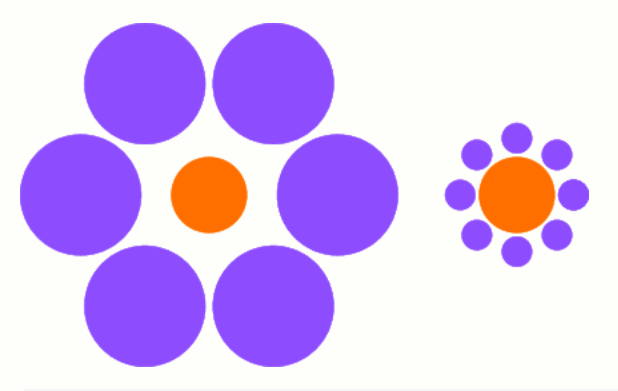

# Circle Illusion: The Perceptual Phenomenon of Size Around a Central Circle


This article discusses the circle illusion, where two identical central circles appear different in size due to surrounding visual context. Built with LaTeX TikZ, this article provides a complete explanation of the code structure and perceptual science behind it.

<!--more-->

## Introduction

In the realm of visual perception, the human brain often processes size **relatively** rather than **absolutely**.  
One of the most well-known examples of this is the **Ebbinghaus Illusion**, or **Circle Illusion**, in which two identical circles appear to be of different sizes due to the surrounding shapes.

This article demonstrates the phenomenon using **LaTeX TikZ**, providing a detailed explanation of each code component and the scientific concept behind it.

---

## LaTeX Source Code

Below is the complete LaTeX code to generate two orange central circles that appear different in size due to variations in the surrounding blue circles.

```latex
\documentclass{standalone}

\usepackage{tikz}

\begin{document}
\begin{tikzpicture}[baseline=(X.base)]
    \node[circle,fill=orange,draw=orange,minimum size=2cm] (X) at (0,0) {};
    \foreach \i in {0,60,...,330}{
        \filldraw[blue!50!white]  (\i:3.4) circle (1.6);}
\end{tikzpicture}
\hspace{1cm}
\begin{tikzpicture}[baseline=(X.base)]
    \node[circle,fill=orange,draw=orange,minimum size=2cm] (X) at (0,0) {};
    \foreach \i in {0,45,...,360}{
        \filldraw[blue!50!white]  (\i:1.5)  circle (.4);}
\end{tikzpicture}
\end{document}
```

---

The output produced:




## Explanation of the Code Structure

### **Document Declaration**
```latex
\documentclass{standalone}
```
The `standalone` document class ensures that only the drawing is rendered—no page margins, headers, or text.  
It’s ideal for generating standalone figures or mathematical graphics.

---

### **Importing the TikZ Package**
```latex
\usepackage{tikz}
```
The TikZ package enables mathematical and geometrical drawing directly within LaTeX, allowing precise vector-based illustrations.

---

### **Start of the Document**
```latex
\begin{document}
```
Marks the beginning of the document body where the drawings and commands are placed.

---

### **First Illustration — Left Circle Illusion**
```latex
\begin{tikzpicture}[baseline=(X.base)]
```
This environment defines a TikZ drawing area.  
The `baseline=(X.base)` ensures that both drawings align vertically when placed side by side.

---

#### **Central Circle**
```latex
\node[circle,fill=orange,draw=orange,minimum size=2cm] (X) at (0,0) {};
```
- Creates a **2 cm diameter orange circle** at the coordinate (0,0).  
- `(X)` labels the node for reference.  
- Acts as the **central reference circle** for the illusion.

---

#### **Surrounding Large Circles**
```latex
\foreach \i in {0,60,...,330}{
    \filldraw[blue!50!white] (\i:3.4) circle (1.6);}
```
- Draws **six large blue circles** spaced 60° apart.  
- Each is 3.4 cm away from the center and has a radius of 1.6 cm.  
- Color: a 50% mix of blue and white for visual softness.  
Result: The orange center appears **smaller** due to large outer circles.

---

### **Horizontal Spacing Between Figures**
```latex
\hspace{1cm}
```
Adds 1 cm of horizontal space between the two figures so they don’t overlap.

---

### **Second Illustration — Right Circle Illusion**
```latex
\begin{tikzpicture}[baseline=(X.base)]
```
Begins the second TikZ environment for the right-hand side illustration.

---

#### **Central Circle**
```latex
\node[circle,fill=orange,draw=orange,minimum size=2cm] (X) at (0,0) {};
```
Identical to the first central circle. Despite being the same size, it will appear **larger** in this visual context.

---

#### **Surrounding Small Circles**
```latex
\foreach \i in {0,45,...,360}{
    \filldraw[blue!50!white]  (\i:1.5)  circle (.4);}
```
- Draws **eight small blue circles**, each spaced 45° apart.  
- Each is 1.5 cm from the center and has a radius of only 0.4 cm.  
Result: The central orange circle now appears **larger**.

---

### **End of Document**
```latex
\end{document}
```
Marks the end of the LaTeX document. The output will show two side-by-side illustrations forming the Ebbinghaus illusion.

---

## Visual Analysis

| Figure | Surrounding Circle Size | Distance from Center | Perceived Effect |
|:--------|:--------------------------|:----------------------|:------------------|
| Left    | Large (1.6 cm radius)     | 3.4 cm                | Central circle looks smaller |
| Right   | Small (0.4 cm radius)     | 1.5 cm                | Central circle looks larger |

Even though both orange circles are identical, the brain **interprets size contextually**, not absolutely.

---

## How the Illusion Works

1. **Contextual Comparison** — The brain interprets object size relative to surrounding objects.  
2. **Visual Normalization** — Perceptual systems normalize differences to simplify spatial processing.  
3. **Environmental Cues** — Large surroundings shrink perception; small surroundings enlarge it.

---

## Further Experiments

Modify the following parameters in the TikZ code to explore different effects:

| Parameter | Purpose | Visual Effect |
|------------|----------|----------------|
| `3.4` / `1.5` | Distance from center | Changes overall spacing |
| `1.6` / `0.4` | Surrounding circle size | Strengthens or weakens illusion |
| Color | Change `blue!50!white` | Alters color contrast and depth |
| Circle count | Change 60° / 45° steps | Affects density and symmetry |

Example variation:
```latex
\foreach \i in {0,30,...,330}{
    \filldraw[green!40!white] (\i:2.5) circle (.8);}
```

---

## Scientific and Artistic Relevance

The circle illusion bridges **psychology, geometry, and art**.  
It provides valuable insights and applications in:
- **Cognitive psychology** — understanding size perception and context.  
- **Design & UI/UX** — using space and contrast for visual emphasis.  
- **Mathematical art** — visualizing relationships between symmetry and illusion.  

---

## Conclusion

The Ebbinghaus Illusion reveals that human perception of size is **context-dependent**, not objective.  
Using **LaTeX TikZ**, we can mathematically recreate this visual phenomenon, blending **science and aesthetics** into a single, elegant representation.

---

## References

1. Ebbinghaus, H. (1897). *Über eine neue Methode zur Prüfung geistiger Fähigkeiten und ihre Anwendung bei Schulkindern.*  
2. Coren, S., & Girgus, J. S. (1978). *Seeing is Deceiving: The Psychology of Visual Illusions.* Lawrence Erlbaum.  
3. Gregory, R. L. (1997). *Eye and Brain: The Psychology of Seeing.* Oxford University Press.  
4. PGF/TikZ Manual, Version 3.1.10 (2023).  

---

**Written by:** [Aan Triono](https://www.aantriono.com)  
**License:** CC BY-SA 4.0

