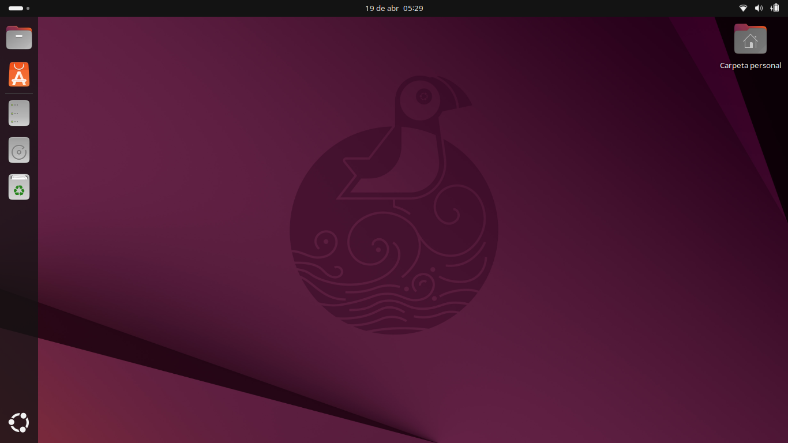
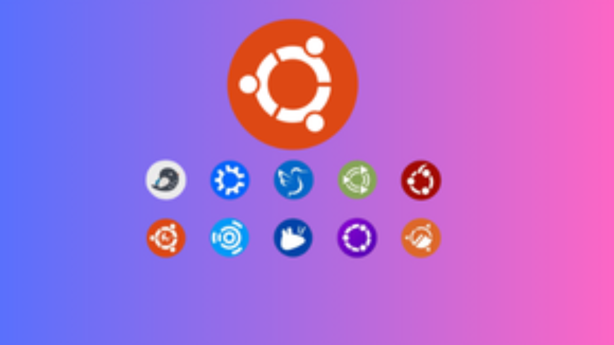
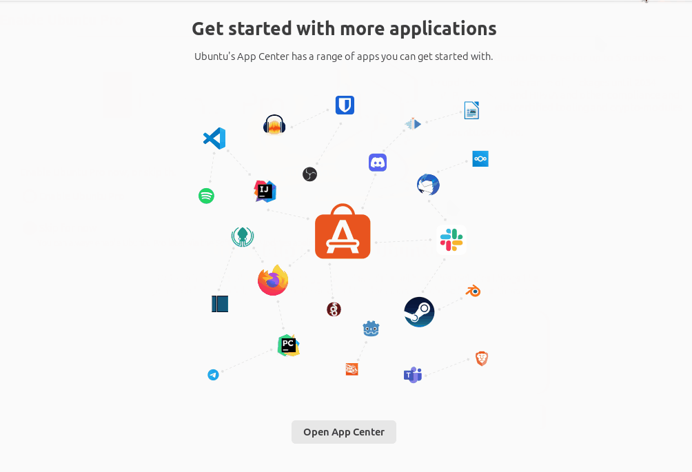
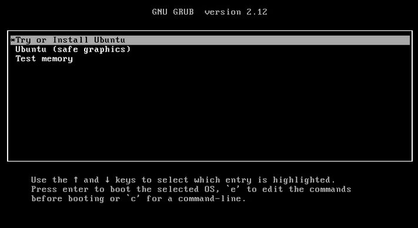

# Getting to Know Ubuntu: A User-Friendly Linux Distribution for All Needs


This article introduces **Ubuntu**, a popular, user-friendly Linux distribution designed for diverse use cases — from personal computing to professional development.

---

<!--more-->

## Introduction

In a world dominated by paid operating systems, **Ubuntu** emerges as a free, secure, and efficient alternative. As one of the most popular Linux distributions worldwide, it has proven itself a reliable and accessible choice for both beginners and IT professionals.

## What Exactly Is Ubuntu?

Ubuntu is a **Linux-based operating system** developed by **Canonical Ltd.**, a company founded by South African entrepreneur **Mark Shuttleworth**. The name “Ubuntu” originates from an African philosophy meaning *“humanity towards others”* or *“I am because we all are,”* reflecting the community spirit at the core of this project.

Built upon **Debian**, one of the oldest and most stable Linux distributions, Ubuntu takes Debian’s robustness and repackages it with a user-friendly interface—making it ideal for newcomers to the Linux ecosystem.

## Key Features of Ubuntu

### 1. Open Source and Free

Unlike commercial operating systems, Ubuntu is completely free to download, use, and distribute. Its open-source nature allows anyone to view, modify, and improve the source code. It’s not just about cost—it’s about **freedom and transparency** in technology.

### 2. Strong Security

Ubuntu is designed with **security** as a top priority. It includes a built-in firewall, data encryption, and automatic security updates. Thanks to Linux’s architecture, Ubuntu is naturally resistant to viruses and malware, making it a safe choice for all types of users.

### 3. Stability and Performance

Ubuntu offers **Long-Term Support (LTS)** versions, supported for **five years** with security updates. These releases ensure long-term stability—ideal for businesses and users who value reliability.

### 4. Intuitive User Interface



*Ubuntu 25.04 desktop running the modern GNOME environment*  
> **Note:** For the latest screenshots, visit [ubuntu.com/desktop](https://ubuntu.com/desktop)

Ubuntu uses the **GNOME** desktop environment by default, offering a modern and elegant experience. The interface is intuitive even for users transitioning from other operating systems. The left-hand dock provides quick access to favorite apps, while the Activities Overview allows fast searching of files, apps, and settings.

## Ubuntu Flavors for Every Need

  
*Various Ubuntu flavors designed for specific use cases*  
> **Note:** Explore all flavors at [ubuntu.com/desktop/flavours](https://ubuntu.com/desktop/flavours)

Ubuntu comes in several editions tailored to different needs:

- **Ubuntu Desktop** – For personal and office use, with a complete graphical interface.  
- **Ubuntu Server** – Optimized for servers and cloud computing, without a GUI for efficiency.  
- **Ubuntu Studio** – Geared toward content creators, including professional tools for audio, video, and graphics.  
- **Kubuntu, Xubuntu, Lubuntu** – Variants using different desktop environments (KDE, Xfce, LXQt) for various performance and aesthetic preferences.

## Advantages of Using Ubuntu

### Active and Supportive Community

Ubuntu’s **community** is one of its greatest strengths. You’ll find active forums, detailed documentation, and countless tutorials in many languages. When an issue arises, someone in the community has likely faced and solved it.

### Wide Hardware Compatibility

Ubuntu supports a vast range of hardware—from old laptops to modern workstations. Most drivers are included out of the box, minimizing manual setup.

### Rich Application Ecosystem

  
*Ubuntu Software Center offers thousands of free apps through an intuitive interface.*

The **Ubuntu Software Center** lets you easily install thousands of free applications—no command line required. From office suites like **LibreOffice** to browsers like **Firefox** and **Chrome**, most tools are available with a few clicks.

### Ideal for Software Development

Ubuntu is a favorite among developers. It supports almost all major programming languages and development tools, making it perfect for **web, mobile, and desktop** development.

## Release Cycle and Support

Ubuntu releases a new version every **April and October**, named based on the year and month—e.g., *Ubuntu 25.04* (April 2025). Each version has a unique codename, such as *“Plucky Puffin.”*

Users can choose between:
- **Regular releases** (9-month support)
- **LTS releases** (5-year support)

For production environments, **LTS** versions are highly recommended.

## Who Should Use Ubuntu?

Ubuntu is suitable for:

- **Linux beginners** exploring an easy-to-learn alternative OS  
- **IT professionals** seeking a stable development or server platform  
- **Educational institutions** wanting a cost-effective, reliable solution  
- **Businesses** reducing licensing costs without compromising security  
- **Content creators** using multimedia tools without expensive software

## Ubuntu Installation Guide

Installing Ubuntu is straightforward—even for beginners.

### Preparation Before Installation

**1. Backup Important Data**  
Always back up essential data before installation, whether to external media or the cloud.

**2. Minimum System Requirements**
- 2 GHz dual-core processor or higher  
- 4 GB RAM (8 GB recommended)  
- 25 GB disk space minimum  
- USB or DVD drive  
- Internet connection (recommended)

**3. Download Ubuntu ISO File**  
Visit [ubuntu.com](https://ubuntu.com) and download the desired ISO—preferably the latest LTS version.

### Creating a Bootable Installation Media

**For USB Drive:**
Use **Rufus** (Windows), **balenaEtcher** (cross-platform), or **Startup Disk Creator** (Linux) to create a bootable USB.

Steps using balenaEtcher:
1. Open balenaEtcher  
2. Select the downloaded Ubuntu ISO  
3. Choose your USB drive  
4. Click “Flash” and wait for completion  

### Step-by-Step Installation

**Step 1: Boot from Installation Media**
- Restart your PC and enter BIOS/UEFI (press F2, F12, Del, or Esc)
- Set USB/DVD as first boot priority  
- Save and reboot  

**Step 2: Start Ubuntu Installer**
Choose:
- *“Try Ubuntu”* — try it live without installing  
- *“Install Ubuntu”* — begin installation  



**Step 3–7:**  
Follow prompts for:
- Language & keyboard layout  
- Internet connection  
- Installation type (erase disk, dual-boot, or manual partition)  
- Timezone selection  
- User account creation  

**Step 8: Installation Process**
Ubuntu will copy files and install. This takes ~15–30 minutes.

**Step 9: Restart**
Once complete, remove the USB and reboot into Ubuntu.



[Full Ubuntu Installation Guide](https://www.linuxbuzz.com/ubuntu-24-04-desktop-installation-guide)



### Post-Installation Setup

  
*Ubuntu welcome screen after first boot.*

**1. Update the System**
```bash
sudo apt update
sudo apt upgrade
```

**2. Install Additional Apps**
Use Ubuntu Software to install:
- Chrome / Firefox  
- VLC Media Player  
- GIMP  
- LibreOffice  

**3. Configure Drivers**
Go to *Software & Updates → Additional Drivers* for proprietary graphics drivers if needed.

**4. Personalize the Desktop**
Settings → Appearance allows theme, wallpaper, and layout customization.

### Dual-Boot Tips

If installing Ubuntu alongside Windows:
- Install **Windows first**
- Disable **Fast Startup** in Windows
- Disable **Secure Boot** if boot issues occur  
- Ubuntu will automatically detect Windows and configure **GRUB** for dual-boot.

## Conclusion

Ubuntu is a comprehensive operating system combining **powerful features, high performance, and user-friendly design**. With strong community support, regular updates, and open-source principles, it remains a top choice for millions worldwide.

For anyone looking to move away from proprietary systems or explore Linux, Ubuntu offers the **perfect entry point**—balancing ease of use, security, stability, and freedom.

---

*Interested in trying Ubuntu? Visit [ubuntu.com](https://ubuntu.com) to download the latest version and start your open-source journey today.*

