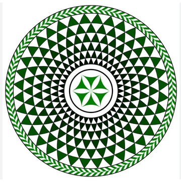

# Creating Pompeii Mosaic Patterns with LaTeX TikZ


This article discusses a comprehensive analysis of Daniel Steger's LaTeX TikZ code for generating Pompeii mosaic patterns — covering code structure, visual philosophy, and scientific and artistic relevance.

<!--more-->

---

## Introduction

This work originates from *Daniel Steger*, who reinterpreted ancient mosaic patterns from the **Casa degli Amorini Dorati** in Pompeii. Using **LaTeX TikZ**, he reconstructed complex geometric forms through the principles of **circle intersection and rotational symmetry**.

The purpose of this article is to dissect the code thoroughly: from technical structure, mathematical principles, visual-philosophical interpretation, to scientific and artistic relevance in the modern era.

---

## LaTeX Source Code

Below is the complete code for generating Pompeii mosaic patterns using TikZ:

```latex
% Author: Daniel Steger
% Source: Mosaic from Pompeji
% Casa degli Armorini Dorati, Living room, mosaic
\documentclass{minimal}
\usepackage{tikz}

\begin{document}

\begin{tikzpicture}[cap=round]
% Colors
\colorlet{anglecolor}{green!50!black}
\colorlet{bordercolor}{black}

%Configuration
\def\alpha{5} % degree
\def\layer{5}

\begin{scope}[scale=5]
\pgfmathsetmacro\sinTriDiff{sin(60-\alpha)}
\pgfmathsetmacro\cosTriDiff{1-cos(60-\alpha)}
\pgfmathsetmacro\radiusC{sqrt(\cosTriDiff*\cosTriDiff + \sinTriDiff*\sinTriDiff)}
\pgfmathsetmacro\startAng{\alpha + atan(\sinTriDiff/\cosTriDiff)}
\pgfmathsetmacro\al{\alpha*\layer}

\foreach \x in {0,\alpha,...,\al}
{
  \pgfmathsetmacro\ang{\x + \startAng}
  \pgfmathsetmacro\xRs{\radiusC*cos(\ang)}
  \pgfmathsetmacro\yRs{\radiusC*sin(\ang)}
  \pgfmathsetmacro\radiusLayer{\xRs + sqrt( 1 - \yRs*\yRs )}
  \pgfmathsetmacro\angRs{acos(\yRs)}
  \pgfmathsetmacro\angRss{acos(\radiusC*sin(\ang-\alpha))}
  \colorlet{anglecolor}{black!\ang!green}
  \pgfmathsetmacro\step{2*\alpha - 180}
  \pgfmathsetmacro\stop{180-2*\alpha}

  \foreach \y in {-180, \step ,..., \stop}
  {
    \pgfmathsetmacro\deltaAng{\y-\x}
    \filldraw[color=anglecolor,draw=bordercolor] 
        (\y-\x:\radiusLayer)    
                arc (-90+\angRs+\deltaAng : \alpha-90+\angRss+\deltaAng :1) 
                arc (\alpha+90-\angRss+\deltaAng : 2*\alpha+90-\angRs+\deltaAng :1)
                arc (\deltaAng+2*\alpha : \deltaAng : \radiusLayer);
  }
}

\pgfmathsetmacro\xRs{\radiusC*cos(\al+\startAng)}
\pgfmathsetmacro\yRs{\radiusC*sin(\al+\startAng)}
\pgfmathsetmacro\radiusLayer{\xRs + sqrt( 1 - \yRs*\yRs )}
\draw[line width=2, color=bordercolor] (0,0) circle (.8*\radiusLayer);
\pgfmathsetmacro\radiusSmall{.7*\radiusLayer}

\foreach \x in {-60,0,...,240}
{
    \fill[color=anglecolor] (\x:\radiusSmall) arc (-180+\x+60: -180+\x: \radiusSmall)
                             arc (0+\x: -60+\x: \radiusSmall)
                             arc (120+\x: 60+\x: \radiusSmall); 
}

\foreach \x in {0, 4, ..., 360}
{
  \fill[color=anglecolor] (\x:1) -- (\x+3:1.05) -- (\x+5:1.05) -- (\x+2:1) -- cycle;
  \fill[color=anglecolor] (\x+5:1.05) -- (\x+7:1.05) -- (\x+4:1.1) -- (\x+2:1.1) -- cycle;
}
\draw[line width=1, color=bordercolor] (0,0) circle (1);
\draw[line width=1, color=bordercolor] (0,0) circle (1.1);
\end{scope}

\end{tikzpicture}
\end{document}
```
---

Keluaran yang dihasilkan:



---

## Code Structure Explanation

### Initialization and Packages
```latex
\documentclass{minimal}
\usepackage{tikz}
```
The code uses the `minimal` class for pure graphics purposes and the `tikz` package for drawing vector shapes.

### Color and Parameter Settings
```latex
\colorlet{anglecolor}{green!50!black}
\colorlet{bordercolor}{black}
\def\alpha{5}
\def\layer{5}
```
- `anglecolor`: dark green gradient color used for rotational effects.
- `bordercolor`: border of each shape in black.
- `\alpha`: angular interval between elements (5°).
- `\layer`: number of main layers (5).

### Basic Geometry Calculations
This section utilizes trigonometry to determine the position and radius of circles resulting from intersections.
```latex
\pgfmathsetmacro\sinTriDiff{sin(60-\alpha)}
\pgfmathsetmacro\cosTriDiff{1-cos(60-\alpha)}
\pgfmathsetmacro\radiusC{sqrt(\cosTriDiff^2 + \sinTriDiff^2)}
```
These values form the foundation for the intersection points between circles that create the hexagonal or flower pattern.

### Creating Segments and Main Pattern
The main `\foreach` loop block repeats rotation every `\alpha` degrees.
```latex
\foreach \x in {0,\alpha,...,\al}
```
In each iteration:
- Center point coordinates are calculated.
- Intersection angles (`\angRs`, `\angRss`) are obtained using `acos`.
- Arc patterns are created through three interconnected `arc` commands, forming leaf-like or scale-like shapes.

### Center and Outer Decorative Elements
This section adds a center circle and small petal ornaments around it.
```latex
\foreach \x in {-60,0,...,240}
```
Forms six symmetric elements, symbolizing the hexagonal harmony characteristic of Roman mosaics.

While the outer circle:
```latex
\foreach \x in {0, 4, ..., 360}
```
Produces a *gear teeth* pattern, symbolizing order and continuity.

---

## Visual and Philosophical Analysis

Visually, this pattern forms **order born from repetition and circle intersections**. In the context of classical Pompeii aesthetics:
- Circles represent **perfection and eternity**.
- Intersections symbolize **the connection between earthly and divine elements**.
- The green-black gradient provides **contrast between life and structure**, giving spatial depth.

Its philosophy approaches the concept of **mandala**, but with an ancient Western geometric touch — not Eastern spirituality, but rather *aesthetic rationality*.

---

## TikZ Variation Experiments

You can explore the following parameters to create variations:

| Parameter | Visual Effect | Example |
|------------|-------------|--------|
| `\alpha` | Controls pattern density | `\def\alpha{10}` → sparser shape |
| `\layer` | Number of rotation layers | `\def\layer{8}` → deeper pattern |
| `anglecolor` | Color scheme | Replace with `blue!50!black` |
| `scale` | Overall pattern size | `scale=3` → denser pattern |

These experiments demonstrate the flexibility of **TikZ as a code-based artistic medium**.

---

## Scientific and Artistic Relevance

From a scientific perspective:
- This code demonstrates **rotational transformation**, **circle intersection**, and **polar symmetry**.
- It can be applied in **computational geometry**, **vector graphics**, and **visual mathematics education**.

Artistically:
- It revives the aesthetics of **Roman architecture** in a digital medium.
- It serves as a concrete example of how **code can become an art canvas**.

---

## Conclusion

Through exploring Daniel Steger's work, we learn that:
> "Code can be a form of art equal to brush and canvas — only it draws with logic and symmetry."

With LaTeX TikZ, the relationship between **science, art, and geometry** unites in harmony echoing the glory of Pompeii.

---

## References

1. Daniel Steger, *TikZ example: Mosaic from Pompeji*, [TeXample.net](https://texample.net/tikz/examples/mosaic-from-pompeji/)
2. Till Tantau, *The TikZ and PGF Manual*, v3.1.10, 2024.
3. Plato, *Timaeus*: on geometry and cosmic order.
4. Gombrich, E. H. *The Sense of Order: A Study in the Psychology of Decorative Art*. Oxford University Press, 1979.

---

**Written by:** [Aan Triono](https://www.aantriono.com)  
**License:** CC BY-SA 4.0
